# Where2Go Product Design

## Product Positioning

Where2Go is an outing decision engine for families and small groups.
It is not an event listing app, a map app, or a review app. Those products help users
find information. Where2Go helps users make a decision.

The product promise:

> Tell us your constraints. We will give you one practical plan for today, plus two useful backups.

## Target User

The first wedge is the busy household planning local leisure time.

| Persona | Need | Constraints | Success |
|---|---|---|---|
| Busy parent | Choose a low-stress family outing quickly | Kid ages, budget, drive time, meal timing, weather, bedtime | One plan the family can leave for without more research |
| Couple or friends | Choose something worth doing today | Mood, time window, budget, novelty, parking, weather | A good plan and a fallback, both easy to act on |
| Visiting-family host | Entertain people in town | Mixed ages, local pride, reliability, food nearby | Explainable plan with timing, cost, directions |
| Local explorer | Avoid repetitive weekends | Preference memory, novelty, disliked categories | Fresh suggestions that still fit practical limits |

## Core Jobs To Be Done

1. When it is Saturday morning, I want one good family plan so that we do not spend an hour searching.
2. When weather or budget limits us, I want alternatives that still feel worthwhile.
3. When I pick a plan, I want timing, food, directions, and cost in one place.
4. When the recommendation is not obvious, I want to know why the app chose it.
5. When my family needs to agree, I want a shareable plan that is easy to discuss.

## MVP Scope

The MVP should focus on the decision loop, not complete market coverage.

### Phase 1 Features

| Feature | User Value | MVP Acceptance Criteria |
|---|---|---|
| Quick Plan Request | User can ask for a plan in one sentence or short form | Request maps to structured constraints |
| Family Profile | User avoids repeated setup | Profile stores adults, kids' ages, budget comfort, drive tolerance, and preferences |
| Budget Guardrail | User avoids surprise cost | Plans show estimated all-in cost range |
| Time Window | User gets realistic timing | Plans respect start/end/home-by constraints |
| Drive-Time Limit | User controls effort | Plans use route duration, not simple radius |
| Place Discovery | App can recommend non-event outings | Places include parks, museums, zoos, arcades, scenic spots, food |
| Event Discovery | App can recommend timely local events | Events include Ticketmaster plus one community-event source where available |
| Hard Constraint Filter | Bad plans are excluded | Closed, too-far, too-expensive, impossible, or age-mismatched options are removed |
| Scoring Engine | App ranks, not lists | Scores are auditable and deterministic |
| Kid-Age Fit | Family plans work for the actual kids | Age-inappropriate options are downgraded or filtered |
| Weather-Aware Planning | Outdoor plans do not ignore conditions | Outdoor plans are paired with indoor or easy backups when weather risk exists |
| Traffic-Aware Travel | Plans reflect current travel effort | Drive estimates use traffic-aware routes where available |
| Today's Best Plan | User sees one leading recommendation | Results screen starts with one plan, not a grid |
| Cheaper Alternative | User has a budget fallback | Lower-cost backup appears when available |
| Rain / Low-Effort Backup | User has a practical safety plan | Backup appears for outdoor or high-friction plans |
| Timeline Builder | User knows how the outing works | Leave, arrive, activity, food, and return times are shown |
| Food Nearby | Meal decisions are handled | At least one plausible food stop is recommended |
| Cost Breakdown | User can judge affordability | Ticket, food, transport/parking, and extras are estimated |
| Why This Plan | Trust is built | Explanation references scored facts |
| Directions | User can act immediately | Map handoff exists for each stop |
| Tickets & Reservations | User can complete booking | Provider links are visible where needed |
| Share Plan | Household can agree | Share payload includes title, timing, cost, links |
| Feedback Loop | Recommendations improve | Accept/reject/save/attended signals are captured |

## Non-Goals For MVP

1. Native iOS/Android apps.
2. Desktop app with local Ollama mode.
3. In-app checkout.
4. Full parking inventory.
5. Live crowd prediction.
6. Group planning across households.
7. Coupons and deals.
8. Full city-by-city tourism feed coverage.
9. A generic infinite event feed.

## Primary User Journey

```mermaid
flowchart LR
    A[Open app] --> B[Enter request or use saved profile]
    B --> C[System extracts constraints]
    C --> D[Fetch places, events, weather, routes, food]
    D --> E[Hard filters]
    E --> F[Scoring engine]
    F --> G[Best plan + two backups]
    G --> H[View timeline and cost]
    H --> I[Open directions / tickets / share]
    I --> J[Feedback captured]
```

## MVP Success Metrics

| Metric | Target Direction | Why It Matters |
|---|---|---|
| Time to first viable plan | Under 2 minutes | Core value is reducing planning time |
| Recommendation acceptance rate | Rising by cohort | Measures whether top plan is useful |
| Share rate | Meaningful share activity | Household decisions are social |
| Save-to-go conversion | Increasing | Distinguishes browsing from execution |
| Feedback coverage | Most rejections tagged | Improves scoring |
| Repeat weekly usage | Strong week-4 retention | Shows weekend habit potential |

## Product Principles

1. One plan first, alternatives second.
2. Hard constraints before AI explanation.
3. Deterministic ranking, generated wording.
4. Cost and time must be visible.
5. Every recommendation needs a reason.
6. Every plan needs a next action.
7. If the data is uncertain, say so plainly.

## Roadmap

| Phase | Features | Why Now |
|---|---|---|
| Phase 1: MVP | Best plan, two backups, itinerary, food, cost, action links, sharing, feedback | Prove the core decision loop |
| Phase 2: V1 | Weekend Optimizer, City & Parks Signals, Parking Check, Crowd & Friction Estimate, Confidence Score, Calendar Save, Favorites/Avoid List, Leave-Now Alerts | Improve trust, reliability, and weekend habit |
| Phase 3: V2 | Plan Change Alerts, Group Planning, Deals & Coupons | Expand into collaboration and savings after single-household flow works |

