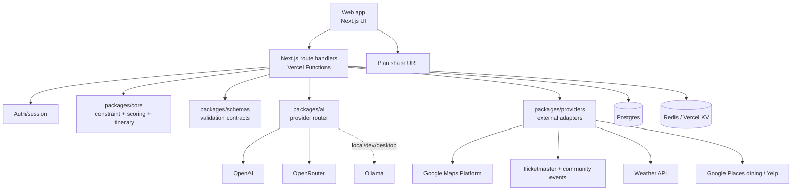
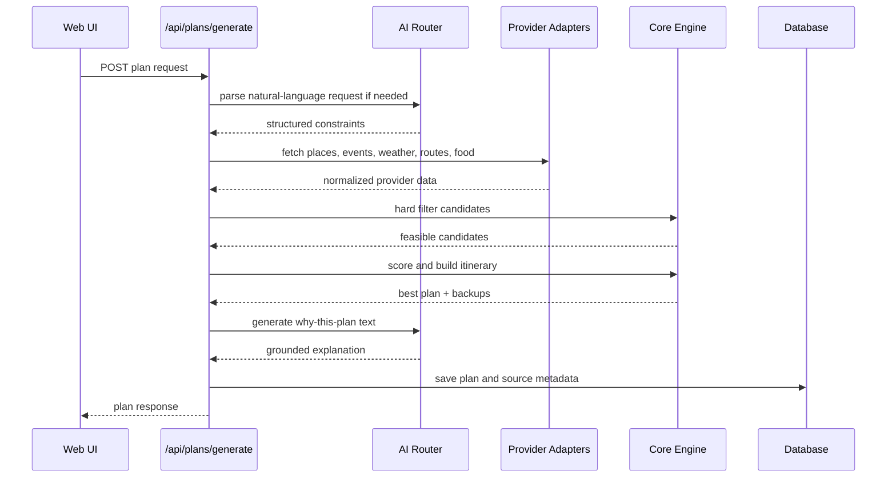

# Where2Go System Architecture

## Decision

Build a web-first TypeScript monorepo:

```text
where2go/
  apps/
    web/                Next.js App Router deployed on Vercel
    mobile/             Expo app after MVP validation
    desktop/            Tauri app after MVP validation
  packages/
    core/               Constraints, scoring, itinerary, cost logic
    schemas/            Zod schemas and shared TypeScript types
    ai/                 OpenAI / OpenRouter / Ollama provider routing
    providers/          Google, Ticketmaster, Eventbrite/Meetup, weather, food adapters
    api-client/         Typed client used by web/mobile/desktop
    ui/                 Shared tokens and portable primitives where practical
    config/             tsconfig, eslint, env parsing, constants
  docs/                 Product, architecture, API, design specs
```

The web app ships first. Mobile and desktop reuse the same backend, schemas, provider adapters, and recommendation logic.

## Platform Responsibilities

| Platform | First Release Role | Later Role |
|---|---|---|
| Next.js web on Vercel | Main consumer app, API routes, shareable plan URLs, auth, billing, analytics | PWA, canonical plan links, admin surfaces |
| Expo mobile | Not in MVP | Native location, push notifications, app links, offline affordances |
| Tauri desktop | Not in MVP | Desktop shell and local Ollama mode |

## Runtime Architecture



## Request Flow: Generate Plan



## Shared Package Boundaries

### `packages/schemas`

Owns all cross-app contracts.

Examples:

1. `PlanRequestSchema`
2. `FamilyProfileSchema`
3. `ConstraintSchema`
4. `CandidateSchema`
5. `ScoredCandidateSchema`
6. `PlanResponseSchema`
7. `FeedbackSchema`
8. `ProviderHealthSchema`

### `packages/core`

Pure TypeScript with no provider SDKs and no database imports.

Responsibilities:

1. Normalize constraints.
2. Apply hard filters.
3. Score candidates.
4. Estimate plan cost.
5. Build timeline.
6. Select backups.
7. Produce explanation factors.

This package should be testable without network calls.

### `packages/providers`

Provider-specific adapters. Each adapter returns canonical schemas, not raw provider objects.

```text
providers/
  google/
    places.ts
    routes.ts
    food.ts
  ticketmaster/
    events.ts
  community-events/
    eventbrite.ts
    meetup.ts
  weather/
    tomorrow.ts
    openweather.ts
```

### `packages/ai`

Routes AI tasks to OpenAI, OpenRouter, or Ollama. The UI never calls model providers directly.

### `packages/api-client`

Typed fetch client shared by web, mobile, and desktop.

## Data Model

| Entity | Purpose | Key Fields |
|---|---|---|
| User | Account owner | id, email, authProvider, createdAt |
| FamilyProfile | Reusable planning context | adults, kidsAges, budgetDefault, driveMinutesDefault, preferences |
| PlanRequest | Original request and constraints | location, date, timeWindow, budget, party, preferenceText |
| Candidate | Normalized place/event/food candidate | source, sourceId, type, title, lat, lng, start/end, cost, tags |
| ScoredCandidate | Candidate plus deterministic score | score, hardFilterStatus, componentScores, explanationFactors |
| Plan | Saved recommendation result | bestPlan, cheaperAlternative, rainBackup, timeline, costBreakdown |
| Feedback | User learning signal | planId, action, reason, rating, attended |
| ProviderFetchLog | Observability and compliance | provider, requestHash, status, latencyMs, cached, error |

## Storage Strategy

| Store | Use |
|---|---|
| Postgres | Users, profiles, plans, feedback, provider logs |
| Redis / Vercel KV | Request cache, provider response cache, rate-limit counters |
| Object storage | Optional plan screenshots/images later |

## Caching

| Data | Cache Window | Notes |
|---|---|---|
| Weather | 15-30 minutes | Short because weather affects recommendation quality |
| Routes / travel time | 5-15 minutes | Depends on traffic freshness |
| Place details | Provider-term compliant | Respect Google/Yelp display and cache rules |
| Event search | 15-60 minutes | Refresh when event date is near |
| AI parse/explanation | Hash-based | Cache by normalized input and plan facts |

## Deployment Model

| Environment | Purpose |
|---|---|
| Local | Development with real provider adapters, explicit credential gates, and optional Ollama |
| Preview | Vercel preview deployments for every PR |
| Staging | One stable environment connected to test keys |
| Production | Vercel production with real provider keys |

## Environment Variables

| Variable | Scope | Notes |
|---|---|---|
| `DATABASE_URL` | Server | Postgres connection |
| `REDIS_URL` | Server | Cache/rate limit |
| `GOOGLE_MAPS_API_KEY` | Server and limited client map usage | Server key for provider calls; browser key restricted by domain if maps render client-side |
| `GOOGLE_SEARCH_API_KEY` | Server | Google Programmable Search JSON API |
| `GOOGLE_SEARCH_ENGINE_ID` | Server | Programmable Search engine ID (`cx`) |
| `GOOGLE_AI_API_KEY` | Server | Google AI / Gemini model calls |
| `GOOGLE_AI_MODEL` | Server | Gemini model name |
| `TICKETMASTER_API_KEY` | Server | Discovery API |
| `EVENTBRITE_TOKEN` | Server | Optional community events |
| `MEETUP_CLIENT_ID` / `MEETUP_CLIENT_SECRET` | Server | Optional community events |
| `WEATHER_API_KEY` | Server | Tomorrow.io/OpenWeather/etc. |
| `YELP_API_KEY` | Server | Optional food enrichment |
| `OPENAI_API_KEY` | Server | Direct OpenAI fallback |
| `OPENROUTER_API_KEY` | Server | Low-cost model routing fallback |
| `OLLAMA_BASE_URL` | Local/desktop/server | Local AI fallback; never assume user-machine localhost from Vercel |

## Security Principles

1. No provider API keys in mobile, desktop, or browser code.
2. Server validates every request with shared Zod schemas.
3. Auth is required for saved profiles, saved plans, and feedback history.
4. Anonymous plan generation can be rate-limited and stored as short-lived sessions.
5. Store children's ages as household planning metadata, not child accounts.
6. Store home location coarsely unless precise routing is explicitly needed.
7. Record provider source IDs for compliance and deletion/update workflows.

## Observability

Every plan generation should log:

1. user/session id
2. request id
3. provider calls
4. cache hit/miss
5. model/provider used
6. latency
7. estimated AI cost
8. number of candidates fetched
9. number filtered out
10. winning score components
11. user action after result

## Cross-Platform Strategy

Develop once does not mean one identical UI everywhere. It means:

1. One backend API.
2. One recommendation engine.
3. One schema package.
4. One AI provider router.
5. One provider adapter layer.
6. One design token system.
7. Thin platform-specific shells.

Web is the first shell. Expo and Tauri come later.

## MVP Engineering Milestones

| Milestone | Deliverable |
|---|---|
| M1 | Monorepo scaffold, Next.js app, shared schemas |
| M2 | Provider adapter mocks, core scoring tests |
| M3 | Real Google Maps/Routes/Weather integration |
| M4 | Ticketmaster plus community event source |
| M5 | AI request parser and explanation generator |
| M6 | Plan generation endpoint and results UI |
| M7 | Share link, feedback, saved profiles |
| M8 | Vercel staging and production deployment |
