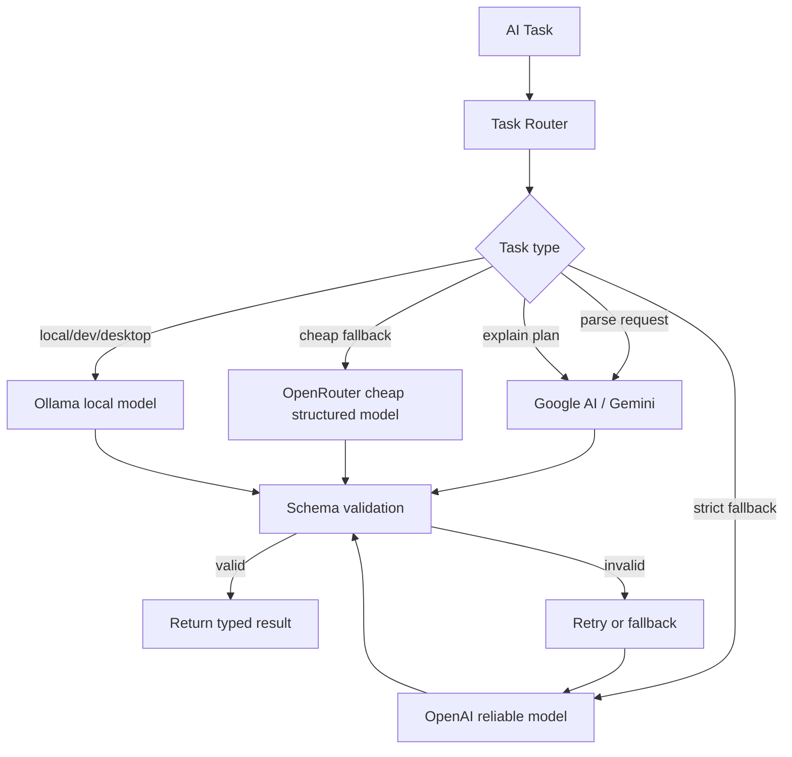

# AI Provider Architecture

## Decision

Use a server-side AI routing layer that can call:

1. Google AI / Gemini as the primary web-app model provider.
2. OpenRouter for cheaper non-Google fallback options.
3. OpenAI for reliable structured fallback.
4. Ollama for local development, desktop local mode, and optional private/local inference.

No browser, mobile, or desktop UI should call AI providers directly.

## AI Boundary

The LLM is not the recommender. The deterministic system owns ranking.

```text
Providers -> normalization -> hard filters -> scoring -> itinerary
                                                   |
                                                   v
                                      LLM writes explanation only
```

Use AI for:

1. parsing natural language into constraints
2. generating concise plan explanations
3. summarizing review snippets when permitted by provider terms
4. rewriting share text
5. extracting preference feedback from free-form text

Do not use AI for:

1. final ranking
2. budget math
3. travel-time math
4. provider search loops
5. inventing place/event details
6. making claims not grounded in scored facts

## Provider Router



## Task Matrix

| Task | Input | Output | Default Provider | Fallback | Cache |
|---|---|---|---|---|---|
| Parse plan request | user text, profile defaults | structured constraints | Google AI / Gemini | OpenRouter, then OpenAI | hash of text + profile defaults |
| Explain plan | scored plan facts | short grounded explanation | Google AI / Gemini | OpenRouter, then OpenAI | hash of plan facts |
| Share summary | plan facts | SMS/share text | Google AI / Gemini | OpenRouter, then OpenAI | hash of plan facts |
| Feedback extraction | free-form rejection | reason tags | Google AI / Gemini | OpenRouter, then OpenAI | no, low value |
| Admin debug summary | logs/errors | concise ops summary | OpenAI or OpenRouter | none | no |
| Local desktop/private mode | prompt + local facts | structured response | Ollama | remote provider if user opts in | local only |

## Provider Selection Rules

1. Prefer Google AI / Gemini for the web app while Google Maps and Google Search are also primary providers.
2. Use OpenRouter or OpenAI for structured fallback when validation fails.
3. Use Ollama only when the runtime can actually reach it.
4. Vercel production must not assume access to `localhost:11434`.
5. Every AI result must pass schema validation before it enters core logic.
6. Store model/provider/latency/cost on every AI call.

## AI Request Contract

```ts
type AiTask =
  | "parse_plan_request"
  | "explain_plan"
  | "share_plan"
  | "extract_feedback"
  | "admin_debug";

type AiProvider = "google-ai" | "openai" | "openrouter" | "ollama";

type AiRoutingPolicy = {
  task: AiTask;
  preferredProvider: AiProvider;
  preferredModel: string;
  fallbackProvider?: AiProvider;
  fallbackModel?: string;
  maxInputTokens: number;
  maxOutputTokens: number;
  temperature: number;
  cacheTtlSeconds?: number;
};
```

## Prompt Grounding

Explanation prompts must receive facts only from the deterministic plan object.

Allowed facts:

1. winning score factors
2. rejected hard constraints
3. travel time
4. cost estimate
5. weather result
6. food option
7. event/place title
8. source/provider names
9. uncertainty flags

Disallowed:

1. "probably popular" unless a provider signal says so
2. fake discounts
3. invented hours
4. invented ticket availability
5. invented parking availability
6. unsupported kid-friendliness claims

## Structured Output Schemas

### Parsed Plan Request

```ts
type ParsedPlanRequest = {
  queryText: string;
  locationText?: string;
  date: string;
  startTime?: string;
  homeByTime?: string;
  party: {
    adults: number;
    kidsAges: number[];
  };
  budgetMax?: number;
  driveTimeMaxMinutes?: number;
  indoorOutdoorPreference?: "indoor" | "outdoor" | "either";
  mealNeeded?: "none" | "snack" | "lunch" | "dinner";
  accessibilityNeeds: string[];
  interests: string[];
  avoid: string[];
  confidence: "high" | "medium" | "low";
  followUpQuestion?: string;
};
```

### Plan Explanation

```ts
type PlanExplanation = {
  headline: string;
  reasons: string[];
  caveats: string[];
  shortShareText: string;
};
```

## Cost Controls

1. Cache AI outputs by normalized input hash.
2. Use deterministic parsing first for simple form inputs.
3. Cap candidate facts sent into explanation prompts.
4. Never send raw provider payloads to models unless needed.
5. Prefer compact JSON facts over prose.
6. Set per-user and per-session generation limits.
7. Track cost per plan generated.
8. Fall back to non-AI template explanations if model calls fail.

## Failure Handling

| Failure | Behavior |
|---|---|
| Provider timeout | Retry once with shorter timeout, then fallback provider |
| Invalid JSON | Retry once with validation error, then fallback provider |
| All AI providers fail | Return deterministic plan with template explanation |
| Ollama unavailable | Hide local mode or route to remote provider if user opted in |
| Cost threshold exceeded | Return deterministic explanation template |

## Template Explanation Fallback

If all AI calls fail, the backend can still return:

```text
Picked because it fits your time window, stays within your drive limit,
has a nearby food option, and is a better weather fit than the other options.
```

This fallback must be assembled from actual scoring factors.

## Desktop Ollama Mode

Tauri can support local Ollama later:

1. Desktop app checks whether Ollama is reachable.
2. User explicitly enables local AI mode.
3. Local calls go from desktop shell to local Ollama.
4. Plan provider data still comes from backend unless offline/local datasets exist.
5. If local mode cannot satisfy a task, app asks before remote fallback.

This is not part of the web MVP.
