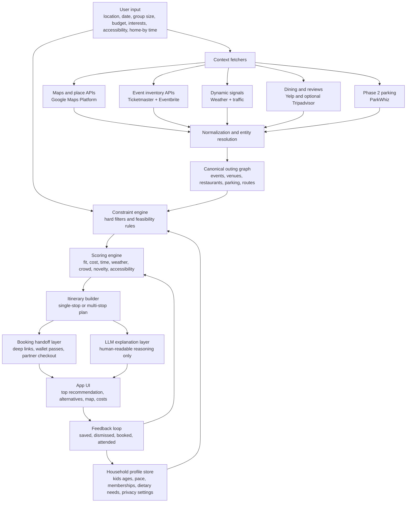

# Local Events and Outings Applications Feature Comparison

## Executive summary

- The current market is crowded with **discovery tools, ticketing tools, review tools, and niche planners**, but very few products act as a true **decision engine** that takes a family or household from “what should we do?” to a ranked, feasible outing plan. Google Maps and TripAdvisor come closest on trip structure; Eventbrite, Ticketmaster, Meetup, Facebook Events, Yelp, and Fever are much stronger at discovery, ticketing, or social proof than at end-to-end planning. citeturn7search8turn7search0turn26search0turn26search2turn22search0turn11search8turn10search0turn1search2turn21search19turn22search12

- The strongest building blocks already exist in the market, but they are **fragmented by domain**: Google Maps is strongest for places, routing, accessibility, and offline maps; Ticketmaster and Eventbrite are strongest for transactable event inventory; Yelp is strongest for restaurant and waitlist depth; PredictHQ is strongest for structured demand signals such as attendance and local rank; AllTrails is strongest for outdoor/offline/pathfinding use cases. citeturn0search16turn7search14turn7search1turn25search0turn11search2turn0search1turn2search0turn4search15turn19search0turn12search13turn12search19turn14search3turn14search4

- The biggest product gaps are **hard-constraint planning** such as budget, drive-time, age suitability, accessibility, open-now logic, and “home by” constraints; **dynamic feasibility** such as weather, traffic, crowding, and parking; and **cross-domain bundling** so that an event, restaurant, parking, and route become one plan rather than four separate searches. citeturn7search0turn7search14turn18search1turn18search0turn12search13turn19search0turn4search1turn7search3

- API availability is a real strategic constraint. Some key platforms are open or commercially accessible, but some important sources are **restricted or uneven**: Facebook’s Event access is limited to Facebook Marketing Partners, Ticketmaster’s Partner API is restricted to official distribution relationships, and Meetup’s API is tied to Meetup Pro capabilities. Several consumer apps in this review did not expose a clearly documented public developer API in the official materials reviewed. citeturn13search2turn0search1turn24search0turn24search5

- The highest-value opportunities for a decision-engine product are to build a **constraint-first ranking engine**, add a **dynamic signal layer** for weather/traffic/crowds/parking, create a **family-and-accessibility profile**, support **bundled booking handoffs** for events + dining + parking, and offer a **trustworthy surprise mode** that introduces novelty without violating budget, timing, or suitability constraints. citeturn7search3turn12search13turn12search15turn19search0turn16search3turn14search4turn21search19

## Standardized feature model

The feature set below standardizes what “local events/outings/planner” products actually do in practice, using the official product and API materials reviewed for this report.

| Code | Standardized feature | Concise definition | What the user sees or interacts with | Typical data sources and APIs used | Why it matters | Example source basis |
|---|---|---|---|---|---|---|
| F1 | Discovery and map browse | Find nearby events, activities, venues, trails, restaurants, and attractions | Search bar, category chips, map pins, nearby lists, city pages | Google Places Nearby Search, Ticketmaster Discovery, Eventbrite city/category discovery, Tripadvisor nearby/location search, Yelp Places Search | This is the entry point for “what exists near me right now?” | citeturn0search0turn11search2turn8search2turn5search8turn4search5 |
| F2 | Personalization profile | Tailor recommendations using interests, past saves, memberships, or social/context data | Interests picker, saved lists, followed organizers, past trips, activity history | First-party profile store, collaborative filtering, history, Meetup interest graph, Fever interests, Tripadvisor Trips, Google saved trips/Timeline | Personalization reduces irrelevant options and increases trust | citeturn16search3turn26search0turn7search6turn10search0turn21search17 |
| F3 | Hard constraints and filters | Respect practical limits such as date, distance, budget, open-now, suitability, and schedule | Filters like price, date, time, open now, activity type, wheelchair-friendly, kid-friendly | Google Places fields and filters, Yelp filters, AllTrails suitability filters, app-side rule engine | Without constraints, discovery becomes overwhelm instead of a decision | citeturn4search15turn4search7turn14search4turn7search9 |
| F4 | Dynamic context signals | Adjust recommendations using real-time or forecast signals | Traffic layer, weather, trail conditions, crisis alerts, rank/attendance, wait times | Google Routes/traffic, OpenWeather or Tomorrow.io, PredictHQ PHQ Attendance and Local Rank, AllTrails Trail Conditions, restaurant waitlist systems | Dynamic conditions determine whether an outing is still actually a good idea | citeturn7search14turn18search1turn18search0turn12search13turn12search19turn3search4turn21search1 |
| F5 | Family and kids mode | Filter or score outings for children, families, or group composition | Family-friendly tags, kid-friendly filters, age fit, stroller-friendly suggestions | AllTrails suitability filters, Tripadvisor family-friendly collections and city guides, first-party family profile | Family planning requires very different ranking than solo discovery | citeturn14search4turn6search1turn26search9 |
| F6 | Accessibility mode | Expose accessibility details and routing needs | Wheelchair-friendly labels, carer ticket policies, accessible seating, accessible transit/venues | Google Maps accessibility settings and Places accessibility fields, Ticketmaster ADA docs, venue FAQs, AllTrails wheelchair-friendly, Fever accessibility FAQs | Accessibility is a hard requirement, not a nice-to-have filter | citeturn7search1turn7search3turn0search13turn14search4turn16search0turn16search2 |
| F7 | Restaurant integration | Pair an outing with meal options before, during, or after | Nearby dining cards, reservations, waitlist buttons, collection lists | Google Places dining attributes, Yelp reservations/waitlist, Tripadvisor restaurants, place reviews/photos | Many local outings are really outing-plus-meal decisions | citeturn7search13turn21search19turn21search1turn26search2turn5search3 |
| F8 | Parking and first-mile or last-mile access | Handle getting from car or transit to the destination | Parking passes, parking lot info, venue directions, ETA, nearby lots | ParkWhiz API, Ticketmaster parking help, Google routing, venue metadata | Friction at the last mile kills otherwise-good plans | citeturn19search0turn11search3turn11search6turn7search14 |
| F9 | Itinerary and route planning | Turn options into a sequenced outing or trip plan | Saved trips, multi-stop routes, trip boards, AI itinerary builder | Google saved trips and My Maps, Tripadvisor Trips and AI itinerary builder, route/solver layer | Users often need a plan, not just a list of options | citeturn7search4turn7search10turn26search0turn6search5 |
| F10 | Booking and checkout | Reserve tickets, tables, or timed-entry slots and access the credential afterward | Buy now, checkout, wallet pass, transfer button, RSVP | Eventbrite checkout/API, Ticketmaster purchase flows and ticket transfers, Fever purchase/transfer, restaurant reservations | Booking is the point where interest converts into action | citeturn2search0turn11search4turn11search13turn3search5turn3search7 |
| F11 | Payments, perks, and affiliate surface | Surface monetizable actions such as vouchers, rewards, add-ons, and partner purchases | Vouchers, rewards, upgrades, parking add-ons, on-site payments | Ticketmaster add-ons and partner commerce, Fever vouchers and Fever Club, Yelp orders/reservations, Tripadvisor Rewards | This is how the planner can monetize without showing ads first | citeturn11search15turn3search9turn3search13turn26search13turn21search19 |
| F12 | Notifications and reminders | Keep the plan alive after discovery or booking | Push reminders, calendar adds, event changes, day-of alerts, cancellation notices | App push/email systems, Eventbrite calendar and update flows, Meetup reminders, Ticketmaster event updates, Fever communication preferences | Notifications convert intent into attendance and reduce no-shows | citeturn2search1turn11search17turn16search1turn20search6turn13search1 |
| F13 | Surprise mode and novelty | Introduce serendipity while staying within user constraints | “Try something new,” personalized unexpected picks, hidden gems | Exploration algorithms, saves/history, collaborative filtering, editorial collections | Novelty is valuable only when still feasible and trustworthy | citeturn22search12turn21search2turn26search9turn6search5 |
| F14 | Offline maps and offline access | Keep maps or tickets usable without connectivity | Downloaded map areas, in-app cached tickets, wallet passes, offline navigation | Google offline maps, AllTrails offline maps, Ticketmaster wallet/offline ticket access, device cache | Connectivity is unreliable exactly when people are out | citeturn25search0turn14search3turn11search7 |
| F15 | Multi-day and recurring planning | Support weekends, short trips, festivals, recurring events, or multi-day outdoor plans | Trip boards, date ranges, multi-day routes, recurring events | Tripadvisor Trips, PredictHQ multi-day event handling, AllTrails multi-day planning, Facebook recurring events | Many outing decisions span more than one stop or one day | citeturn26search0turn12search15turn14search1turn13search16 |
| F16 | Privacy and data controls | Let users manage history, account data, payment methods, visibility, and deletion | Delete account, export data, timeline controls, privacy settings, hide interests | Account settings, privacy centers, timeline controls, data export tools | Trust is critical when planning reflects location, family, and spending behavior | citeturn7search6turn24search2turn14search11turn16search6turn16search8 |

## Where2Go feature-matrix alignment

The product feature matrix translates the market model above into a build sequence. The core product decision is to make **one recommended plan** the MVP outcome, while treating heavier logistics signals such as parking, crowding, proactive alerts, group planning, and deals as later phases.

| Phase | Product intent | Matrix feature areas | Key features |
|---|---|---|---|
| Phase 1: MVP | Prove that users prefer a feasible plan over a long discovery list | Planning input, discovery, decision engine, recommendation, itinerary, trust, action, learning | Quick Plan Request, Family Profile, Budget Guardrail, Time Window, Drive-Time Limit, Place Discovery, Event Discovery, Hard Constraint Filter, Scoring Engine, Kid-Age Fit, Weather-Aware Planning, Traffic-Aware Travel, Today's Best Plan, Cheaper Alternative, Rain / Low-Effort Backup, Timeline Builder, Food Nearby, Cost Breakdown, Why This Plan, Directions, Tickets & Reservations, Share Plan, Feedback Loop |
| Phase 2: V1 | Make the planner more dependable and more memorable | Public/civic signal expansion, friction intelligence, weekend planning, parking, confidence, calendar, saved preferences, reminders | City & Parks Signals, Crowd & Friction Estimate, Weekend Optimizer, Parking Check, Confidence Score, Calendar Save, Saved Favorites & Avoid List, Leave-Now Alerts |
| Phase 3: V2 | Expand from one-household decisions into proactive and social planning | Monitoring, collaboration, savings | Plan Change Alerts, Group Planning, Deals & Coupons |

## Comparative review of existing apps and services

**Legend:** ✓ = strong first-party support; ◐ = partial, limited, organizer-dependent, or off-platform; — = not meaningfully supported in the reviewed public materials; N/A = not comparable in current public materials.

### Feature matrix across discovery and logistics

| App or service | Product type | Public API status from official materials reviewed | F1 | F2 | F3 | F4 | F5 | F6 | F7 | F8 | Implementation differences | Primary sources |
|---|---|---|---|---|---|---|---|---|---|---|---|---|
| Google Maps | Consumer map/place app + platform | Public platform APIs | ✓ | ◐ | ◐ | ✓ | — | ✓ | ✓ | ◐ | Best-in-class map, routing, place, accessibility, and offline layers; weak native ticketing and no dedicated family planner | citeturn7search8turn7search0turn25search0turn7search1turn7search14turn7search3turn7search6 |
| Eventbrite | Consumer event app + organizer platform | Public API | ✓ | ◐ | ◐ | — | — | — | — | — | Very strong community-event discovery and checkout; limited real-time logistics and no cross-domain planner | citeturn22search0turn8search2turn2search0turn22search18turn20search10 |
| Meetup | Consumer community/events app | Restricted to Meetup Pro use cases | ✓ | ✓ | ◐ | — | — | — | — | — | Strongest interest/community graph in the set; logistics, ticketing, and hard-constraint planning are weak | citeturn10search0turn10search2turn2search1turn24search0turn24search5turn24search2 |
| Facebook Events | Events module inside Facebook | Restricted; events access limited to Facebook Marketing Partners | ✓ | ✓ | ◐ | — | — | — | — | — | Social graph is the differentiator; implementation is stronger for invites and RSVPs than for planning or APIs | citeturn1search2turn1search3turn13search1turn13search2turn13search5turn13search16 |
| Ticketmaster | Ticketing and event commerce app | Discovery API public; Partner API restricted | ✓ | ◐ | ◐ | ◐ | ✓ | ✓ | — | ✓ | Best in class for official ticketing, add-ons, venue details, parking passes, and ADA; weak for broad outing bundling | citeturn11search8turn11search2turn0search1turn11search3turn11search6turn0search13turn11search13 |
| Yelp | Local business/reviews app | Public Places API | ✓ | ✓ | ✓ | ◐ | — | — | ✓ | — | Restaurant and local-business depth is excellent, including reservations and waitlist; event/outing planning is secondary | citeturn21search19turn4search15turn4search5turn21search1turn21search2turn4search13 |
| PredictHQ | B2B demand-intelligence API | Public commercial API | ✓ | — | ✓ | ✓ | — | — | — | — | Infrastructure, not an end-user app; extremely valuable for local-rank, attendance, and multi-day event intelligence | citeturn12search1turn12search13turn12search19turn12search15turn12search18 |
| AllTrails | Outdoor discovery/planning app | No public developer API identified in reviewed materials | ✓ | ◐ | ✓ | ✓ | ✓ | ✓ | — | — | Strongest outdoor planner with offline navigation, trail conditions, and suitability filters; narrow domain coverage | citeturn14search1turn14search3turn14search4turn14search8turn14search2turn14search11 |
| TripAdvisor | Travel/activities/reviews app | Public commercial Content API | ✓ | ✓ | ◐ | — | ◐ | ◐ | ✓ | — | Strong at trip-level and destination-level planning with AI and saves; weaker at local real-time decisioning | citeturn26search2turn26search0turn6search5turn5search0turn5search3turn26search13 |
| Fever | Curated city experiences app | No public developer API identified in reviewed materials | ✓ | ✓ | ◐ | — | ◐ | ✓ | — | — | Strong curated urban-experience discovery, vouchers, and ticket flows; thin logistics and no itinerary tooling | citeturn22search12turn16search3turn3search5turn3search7turn16search0turn16search2turn16search1turn16search6 |
| Nearify | Legacy/ambiguous brand state | N/A | N/A | N/A | N/A | N/A | N/A | N/A | N/A | N/A | Current public “Nearify” materials point to an attendee-networking/check-in product at nearify.org, while third-party listings reference an older discover-events app; to avoid conflating them, this comparison marks Nearify as N/A | citeturn17search0turn17search3turn17search8 |

### Feature matrix across planning, booking, retention, and trust

| App or service | Product type | F9 | F10 | F11 | F12 | F13 | F14 | F15 | F16 | Implementation differences | Primary sources |
|---|---|---|---|---|---|---|---|---|---|---|---|
| Google Maps | Consumer map/place app + platform | ◐ | — | — | ◐ | — | ✓ | ◐ | ✓ | Saved trips and My Maps help with structure, but there is no true outing itinerary or commerce layer | citeturn7search4turn7search10turn25search0turn7search6turn7search2 |
| Eventbrite | Consumer event app + organizer platform | — | ✓ | ✓ | ◐ | — | ◐ | ◐ | ◐ | Excellent core checkout; organizer-side monetization is strong; attendee-side retention is improving but still not planner-grade | citeturn22search0turn22search18turn20search10turn20search6turn20search9 |
| Meetup | Consumer community/events app | ◐ | ◐ | — | ✓ | ◐ | — | ◐ | ✓ | Calendar and reminders are strong; still closer to community coordination than itinerary planning or commerce | citeturn2search1turn10search6turn24search0turn24search2 |
| Facebook Events | Events module inside Facebook | ◐ | ◐ | ◐ | ✓ | ◐ | — | ◐ | ✓ | Strong for invites, calendars, and privacy controls; ticketing often depends on partners or link-outs | citeturn13search1turn13search5turn13search16turn13search2 |
| Ticketmaster | Ticketing and event commerce app | — | ✓ | ✓ | ✓ | — | ✓ | — | ◐ | Best post-discovery operational flow: buy, transfer, wallet, event updates, parking add-ons, ADA info | citeturn11search4turn11search13turn11search17turn11search15turn11search7 |
| Yelp | Local business/reviews app | — | ◐ | ✓ | ◐ | ◐ | — | — | ◐ | Reservations, waitlist, delivery, and deals are strong, but there is no true outing-plan object | citeturn21search19turn21search1turn4search2turn4search0turn21search2 |
| PredictHQ | B2B demand-intelligence API | ◐ | — | — | — | — | — | ✓ | — | No consumer UX; valuable behind the scenes for ranking, multi-day handling, and demand-aware planning | citeturn12search11turn12search15turn12search18 |
| AllTrails | Outdoor discovery/planning app | ✓ | — | — | ◐ | ◐ | ✓ | ✓ | ✓ | The best planner in this set for a narrow domain: custom routes, multi-day backpacking, offline maps, and data/privacy controls | citeturn14search1turn14search3turn14search2turn14search11 |
| TripAdvisor | Travel/activities/reviews app | ✓ | ✓ | ✓ | — | ◐ | — | ✓ | ◐ | Trips plus AI planning are much closer to the target vision than most competitors, but live logistics are still thin | citeturn26search0turn26search2turn26search13turn5search0turn5search3 |
| Fever | Curated city experiences app | — | ✓ | ✓ | ✓ | ◐ | — | — | ✓ | Great at curated discovery and purchase; weak at “what should we do as a whole outing?” planning | citeturn3search5turn3search7turn3search9turn3search13turn16search1turn16search6turn16search8 |
| Nearify | Legacy/ambiguous brand state | N/A | N/A | N/A | N/A | N/A | N/A | N/A | N/A | Not compared apples-to-apples because the currently documented product is materially different from the legacy event-discovery app | citeturn17search0turn17search3turn17search8 |

## Decision-engine gaps and prioritized opportunities

Across the reviewed products, five patterns stand out. Discovery is commoditized; ticketing and reviews are mature; niche planners can be excellent in their domain; but there is still very little support for **household-style decisioning under constraints**. The opportunity is not to out-list everyone else. It is to **orchestrate fragmented inputs into one trusted recommendation**. citeturn7search8turn22search0turn11search8turn21search19turn14search3turn26search0

| Matrix priority | Opportunity | What the product should do | Why the opening exists | Required inputs and likely APIs |
|---|---|---|---|---|
| Phase 1: MVP | Constraint-first ranking engine | Rank outing options using hard rules first: budget cap, departure window, drive-time limit, group size, kid-age fit, open hours, weather, and "home by" time | Existing apps mostly optimize discovery, popularity, or ticket conversion, not feasibility under real constraints | Google Places and Routes; weather API; first-party Family Profile; venue/event metadata |
| Phase 1: MVP | Single-plan outing composer | Produce Today's Best Plan plus Cheaper Alternative and Rain / Low-Effort Backup, then turn the chosen option into a timeline with food, cost, directions, ticket/reservation links, and share text | Competitors usually own one leg of the journey and stop before the household has an executable plan | Ticketmaster/Eventbrite/Meetup for events; Google Maps for places/routes; Yelp or Google dining data; outbound provider links |
| Phase 1: MVP | Family profile and kid-age fit | Capture reusable household preferences such as kids' ages, budget comfort, drive tolerance, indoor/outdoor preference, dietary needs, and feedback | Family planning requires different ranking than solo discovery, but most incumbents expose family context only as scattered filters | First-party profile store; Google/Yelp place metadata; event categories; feedback loop |
| Phase 2: V1 | Logistics confidence layer | Add City & Parks Signals, Crowd & Friction Estimate, Parking Check, Confidence Score, Calendar Save, Saved Favorites & Avoid List, and Leave-Now Alerts | Users abandon plans when they discover crowding, parking, event impact, civic alternatives, or timing issues too late | City/tourism/NPS/Socrata feeds; PredictHQ or BestTime; ParkWhiz; calendar and notification services |
| Phase 3: V2 | Collaborative and savings-aware planning | Add Plan Change Alerts, Group Planning, and Deals & Coupons after the single-household planner is reliable | Group decisions and savings are valuable, but they add workflow complexity after the main recommendation engine is proven | Multi-profile preference model; deals/coupon partners; reservation and commerce links; monitoring jobs |

These opportunity choices are strongly supported by the reviewed ecosystem. Google Maps, Yelp, Ticketmaster, and AllTrails all prove that users value strong logistics or suitability data when it is present. PredictHQ proves that attendance and demand signals can be modeled. TripAdvisor proves users will engage with AI trip-building when it is grounded in saved places and structured content. But none of the reviewed products combine those strengths into a single local decision engine. citeturn7search14turn7search1turn21search19turn11search3turn14search4turn12search13turn26search0

## Recommended integrations and architecture

### Minimal viable integrations

The leanest viable stack is not “every data source.” Based on the feature matrix, Phase 1 needs a **geospatial spine**, **event inventory**, **weather and traffic context**, **restaurant/food adjacency**, **basic cost estimation**, and **outbound action links**. Phase 2 can then add city/parks feeds, parking inventory, crowd/friction scoring, calendar save, and leave-time alerts.

| Integration | Recommendation | Why it belongs / when to use | API/access note | Primary source |
|---|---|---|---|---|
| Google Maps Platform | **Yes — core** | Gives you search, nearby places, place details, routing, travel time, accessibility fields, restaurant attributes, autocomplete, geocoding, and offline-map-compatible UX patterns | Public commercial APIs; pay-as-you-go pricing | citeturn0search16turn7search3turn7search13turn7search14turn0search12 |
| Ticketmaster Discovery API | **Yes — core** | Strong official source for concerts, sports, comedy, theater, family events, venues, and source metadata | Discovery is public; transactable Partner API is restricted | citeturn11search2turn0search1turn11search8 |
| Eventbrite Platform API | **Yes — core** | Adds community events, classes, local activities, workshops, and long-tail local inventory that Ticketmaster does not cover well | Public API with OAuth 2.0 | citeturn2search0turn22search0 |
| Weather API | **Yes — core** | Weather changes whether an outing is viable; choose **Tomorrow.io** for richer hyperlocal/alert layers or **OpenWeather** for simpler, cost-effective forecast access | Public commercial APIs; either provider works for an MVP | citeturn18search1turn18search11turn18search0turn18search10 |
| Yelp Places API | **Yes — core if dining matters** | Best addition for dining, review excerpts, price level, and reservations/waitlist-adjacent restaurant context | Public self-serve API | citeturn4search15turn4search5turn4search3 |
| PredictHQ Events API | **Phase 2 — crowd/friction enrichment** | Best source reviewed for attendance, local-rank, and multi-day event intelligence; especially valuable once the product adds Crowd & Friction Estimate and Weekend Optimizer | Public commercial API, but not consumer-facing | citeturn12search1turn12search13turn12search19turn12search15 |
| ParkWhiz API | **Phase 2 — parking check** | Solves a painful last-mile problem and supports search and booking for parking after the MVP proves core recommendation quality | Partner-oriented API and SDKs | citeturn19search0turn19search2turn19search4 |
| Tripadvisor Content API | **Optional enrichment** | Useful for attraction photos, reviews, and attraction/restaurant/hotel content, but less essential than Maps + Ticketmaster + Eventbrite + Yelp for MVP local planning | Public commercial API with display and caching constraints | citeturn5search0turn5search5turn5search9 |

A practical MVP should **not** depend on Facebook Events as a primary ingestion source because Facebook’s event access is restricted, and it should treat Meetup as a secondary/partnership path because current API capabilities are tied to Meetup Pro capabilities rather than broad public consumer ingestion. citeturn13search2turn24search0turn24search5

### Proposed data architecture

The architecture below is designed for a decision-engine product rather than a search directory. It separates **ingestion**, **normalization**, **constraint handling**, **ranking**, and **explanation**, which makes the system easier to trust and to improve over time. This structure is also aligned with the strengths and limitations of the source systems reviewed above. citeturn0search16turn11search2turn2search0turn12search13turn19search0

## Methodology and interpretation notes

This comparison is based on official product sites, help centers, app-store pages, and developer documentation that were publicly accessible on **June 27, 2026**. Ratings in the matrices reflect the **user-facing product capability** documented in those materials, not undocumented features, experiments, or scraped behavior. Features that were roadmap-only, partner-only, or organizer-dependent were marked **partial** rather than full support. Nearify was treated as **N/A** because current official public materials point to a different attendee-networking/check-in product than the older discover-events app still referenced by third-party listings. citeturn20search10turn17search0turn17search3

The analytical conclusion is straightforward: a new entrant does **not** need to beat Google Maps at maps, Ticketmaster at ticketing, Yelp at restaurant reviews, or AllTrails at outdoor navigation. The product opportunity is to sit above those systems and answer the question they do not fully answer on their own:

**“Given our constraints, where should we go, and what is the best plan for today?”** citeturn7search8turn11search8turn21search19turn14search3turn26search0
