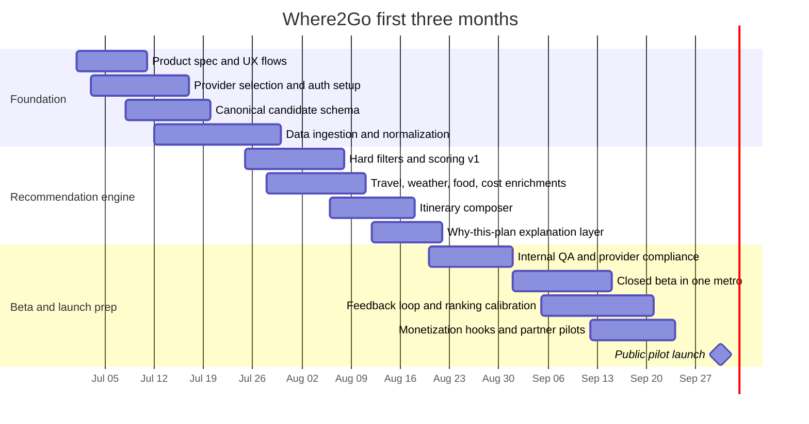

# Where2Go Competitive Analysis and Product Blueprint

## Executive summary

The current market is fragmented by job-to-be-done. Google Maps and Yelp are strongest at place search, local business metadata, routing, and reviews; Ticketmaster and Eventbrite are strongest at ticketed-event inventory and checkout; Meetup and Facebook Events are strongest at socially anchored activities; Tripadvisor, Wanderlog, Roadtrippers, TripIt, Cozi, and FamilyWall are strongest at trip organization, collaboration, or family coordination; and PredictHQ is a business-facing event-intelligence layer rather than a consumer outing app. None of the reviewed products is designed primarily to answer a constrained family question like “What should we do this afternoon within 25 minutes, under $120, with kids, and low hassle?” citeturn26search1turn23view7turn20search17turn23view6turn1search0turn21search0turn19view6turn19view7turn30search0turn4search1turn4search2turn16search10

For a Where2Go MVP, the most robust documented building blocks are Google Maps Platform for places, geocoding, routing, traffic-aware feasibility, and optionally weather; Ticketmaster Discovery for official ticketed events; Eventbrite or Meetup for community-driven events where access and coverage support it; and Google/Yelp-style restaurant and local-business metadata for Food Nearby and cost context. PredictHQ, ParkWhiz, NPS/city feeds, and BestTime are still valuable, but the feature matrix places them in Phase 2 because they support Crowd & Friction Estimate, Parking Check, City & Parks Signals, Weekend Optimizer, and Confidence Score rather than the first proof of one useful plan. citeturn19view0turn6search3turn3search17turn29search14turn22search0turn23view3turn16search10turn34view1turn18search2turn33search0turn28search0

The main source risks are also clear. Eventbrite’s public event-search endpoints by location and category are deprecated, so it is better treated as a consumer benchmark than as a primary supply API; Facebook’s event data is constrained by Graph API permissions and is not a dependable broad public-events feed; Tripadvisor’s legacy Content API is scheduled to sunset on August 31, 2026; and TripIt’s public API is closed to new integrations. citeturn31search0turn31search1turn5search0turn5search3turn34view5turn34view4

The product opportunity for Where2Go is therefore not another listing app. It is a **decision engine** that converts fragmented supply into a ranked, explainable recommendation and, ideally, a low-friction itinerary. The defensible layer is the ranking logic: family fit, budget fit, drive-time tolerance, opening-hours fit, weather suitability, crowd risk, and nearby meal/parking convenience, all turned into one actionable plan instead of a long list of options. That design is especially feasible because Google Places now exposes family-, accessibility-, and parking-relevant fields, while routing, weather, and crowding signals can be added through documented APIs. citeturn6search3turn3search17turn29search14turn28search0

## Competitor landscape

A useful way to read the landscape is by specialization. Some products are good at **finding places**, some at **finding official events**, some at **organizing people and itineraries**, and some at **forecasting demand**. Where2Go’s gap sits between them: it needs to orchestrate these specializations into a single “best next outing” recommendation. citeturn26search1turn23view7turn20search17turn23view6turn16search10

### Discovery, marketplaces, and event-intelligence products

| App | Feature name | What it does | How a user uses it | Data sources used | Strengths | Limitations | API availability and pricing | Primary sources |
|---|---|---|---|---|---|---|---|---|
| Google Maps | Nearby search, directions, saved lists, shared lists | Finds nearby places and “things to do,” shows ratings and descriptions, gets directions across multiple modes, and lets users save/share lists of places. The consumer app supports up to 9 added stops in a route. | Search “museums near me” → inspect ratings/photos → tap Directions → optionally Save to a list and share or collaborate on that list. | Google Places database; business/place submissions; reviews/photos and other Google Maps content surfaced through Places APIs and Maps product flows. | Best-in-class place coverage, routing, saved lists, collaboration, and mature developer tooling. Places API also exposes useful family/decision fields such as `goodForChildren`, `parkingOptions`, `outdoorSeating`, and wheelchair-accessibility attributes. | Weak on first-party event inventory and end-to-end itinerary optimization. Google Maps saved lists are not a true family decision engine, and the public product does not expose an official “popular times” API. | Strongest platform in the set. Places, Geocoding, Routes, and Weather are documented. Pricing is usage-based or subscription-based; subscriptions start at $100/month and new customers get a $300 trial credit. A no-cost demo key exists for prototyping selected services, but it is not for production. citeturn19view0turn34view6 | citeturn26search1turn26search0turn25search0turn25search10turn6search3turn19view0turn34view6 |
| Eventbrite | Curated local events, personalized recommendations, ticketing | Consumer app for discovering local events and getting tickets; especially strong for workshops, classes, community events, and smaller local happenings. | Open the app/site → browse curated local events or recommendations → pick an event → purchase or RSVP. | Event listings created by organizers on Eventbrite. | Good long-tail local discovery and organizer ecosystem; useful benchmark for UX around browse, categories, and ticket conversion. | API is not a strong general-purpose discovery source for Where2Go because public Event Search endpoints by location and category are deprecated. Coverage depends on organizers choosing Eventbrite. | Public API exists, uses OAuth/private-token auth, and default rate limits are 2,000 calls/hour and 48,000/day. Good for organizer-owned workflows and Eventbrite data access, but poor as a broad newly-built public-discovery feed because search endpoints were deprecated. | citeturn20search17turn20search5turn0search2turn9search0turn31search0turn31search1 |
| Meetup | Interest-based groups, local activities, RSVP/community | Helps people discover local groups and events around shared interests, from hiking to tech to social activities. | Choose interests or a city → browse groups/events → RSVP or join a group → attend recurring meetups. | Events and groups created by organizers on Meetup. | Strongest consumer product for recurring communities and hobby-based discovery; high signal for “people like us attend this.” | Not optimized around families, budgets, or frictionless same-day local planning. Supply is limited to Meetup-hosted communities. | API access changed in February 2025 to GraphQL; official help says integrations must transition to GraphQL, and the docs market API access as part of Meetup Pro. Pricing is not publicly posted in the developer docs reviewed. | citeturn23view6turn20search16turn0search7turn23view3 |
| Facebook Events | Social discovery, friend/community event intent, event pages | Lets users discover, plan, and respond to events with friends and communities on and off Facebook. | See an event in feed/groups/pages → respond Interested/Going → share with friends or manage event details. | Events created on Facebook by users, pages, groups, and businesses. | Large consumer reach and powerful social graph; valuable for intent and social proof. | Developer access is constrained and not reliable as a broad public-events ingestion source. Event/privacy access depends on Graph API permissions and/or page/user relationships. | Graph API event objects exist, but practical access is permission-bound and unsuitable as a general public events marketplace replacement. Pricing is not the issue; access constraints are. | citeturn1search0turn5search0turn5search3turn5search6 |
| Ticketmaster | Official live-event discovery, seat selection, verified ticketing | Consumer app for discovering concerts, sports, comedy, theater, and family shows; supports favorites, buying, ticket access, transfer, and resale. | Favorite an artist/team/venue → browse events → choose a seat → buy → transfer/manage tickets inside the app. | Ticketmaster network sources, including Ticketmaster, Universe, FrontGate, Ticketmaster Resale, and related platforms. | Best official ticketed-event source in this comparison; good freshness, official inventory, ticket status, and reliable taxonomy around venues/attractions/events. | Narrower than “where should we go?” because it centers ticketed live events, not parks, community happenings, or casual outings. | Discovery API is open, global, and well-documented. Default quota is 5,000 API calls/day and 5 requests/second. Partner API for commerce is restricted to official distribution partners. | citeturn23view7turn22search0turn22search1turn22search7 |
| Yelp | Restaurant and local-business search, filters, reservations/quotes | Helps users discover local businesses, especially restaurants and services, with filters, reviews, photos, reservations, delivery, and quotes. | Search “kid-friendly brunch” or “parks nearby” → filter by price/open now/rating → inspect reviews/photos → reserve, call, or navigate. | Yelp business listings plus user-generated reviews/photos and business metadata. | Excellent complementary source for post-activity dining and local-business quality signals; strong filters. | Not an event-first app. API only returns businesses with Yelp user-generated content, and full review text is not available through the Places API. | Yelp Places API is documented and commercialized. Trial plans can be as low as 300 calls/day; paid plans include 30,000 calls/month by default with up to 5,000/day, and higher usage is sales-based. Search returns up to 240 businesses. | citeturn24search0turn11search15turn34view1turn34view2turn34view3 |
| Tripadvisor | Reviews, saves, AI trip builder, booking, itineraries | Lets users save hotels/restaurants/experiences, get recommendations and review summaries, organize itineraries, and book stays/experiences. | Search a destination or nearby area → save attractions/restaurants → use AI trip builder or create an itinerary → book experiences. | Tripadvisor traveler reviews and listings for attractions, hotels, restaurants, and experiences. | Strong social proof and “things to do” content; useful benchmark for save/plan/book loops and AI-assisted trip assembly. | Better for destination travel than hyperlocal same-day decisioning. Legacy Content API is in transition. | Tripadvisor’s legacy Content API is set to sunset on August 31, 2026, with migration toward Terra. Development/QA limits are officially published at 50 calls/second and 1,000/day, with 10,000/day after approval. | citeturn21search0turn21search6turn21search7turn12search1turn34view5turn3search1 |
| PredictHQ | Global events intelligence, impact features, demand relevance | B2B product, not a consumer outing app. It normalizes real-world events and offers ML-ready features, forecasts, and a web UI for impact analysis. | An analyst or product team queries events in a place/date range or uses the web app to understand what will likely affect demand. | PredictHQ’s structured, verified global event dataset and derived features. | Best option for normalized event intelligence rather than consumer ticketing; strong for deduplication, impact ranking, attendance/spend signals, and demand awareness. | Not consumer-facing, no direct checkout, and no native place exploration UX. Best used as an internal intelligence layer beneath Where2Go. | Events API, Features API, Forecasts API, Places API, and related tools are documented. Pricing is demo/free-trial led rather than publicly posted as a simple self-serve rate card. | citeturn16search10turn16search0turn16search1turn27view0 |
| Local tourism portals | Official destination calendars, local festivals, civic events | Destination marketing organizations and city portals often publish event calendars, attractions, partner listings, and ticketed-event feeds. | User opens a city or tourism site → browses local calendar or themed “things to do” pages → clicks through for event details or tickets. | Destination marketing organizations, partner submissions, venue feeds, ticketing-feed partners, and in open-data cases municipal datasets. | Often the best source for truly local, official, non-ticketmasterized events such as farmers markets, parades, and civic happenings. | Extremely fragmented. UX, metadata quality, API support, deduplication, and freshness vary widely by city/portal operator. | No standardized universal API. In practice, access varies by portal. Some municipal/open-data portals expose APIs through Socrata; some tourism platforms like Simpleview support event calendars and ticketed feeds, often via partner/custom integrations. | citeturn7search0turn7search3turn7search24turn7search1turn7search8turn7search23 |

### Planning, itinerary, and family-organization adjacencies

| App | Feature name | What it does | How a user uses it | Data sources used | Strengths | Limitations | API availability and pricing | Primary sources |
|---|---|---|---|---|---|---|---|---|
| Wanderlog | Collaborative itinerary, map planning, budget splitting | Lets users plan trips, add places to a map, collaborate with others, organize reservations, and track/split expenses. | Create a trip → add destinations/places to sections or days → collaborate with companions → track budget and export/share. | User-entered trip plans plus destination/place information surfaced inside the app. | Closest consumer benchmark for “map + itinerary + collaboration + budget” in a polished interface. | More trip-planning than local same-day discovery; not built around live nearby event availability, weather, parking, or family scoring. | Free consumer app with optional Pro subscription. No public developer API surfaced in the official product materials reviewed. | citeturn4search0turn4search4turn19view6 |
| Roadtrippers | Route-first stop discovery, trip guides, offline maps | Helps users discover stops along a route, save trips, collaborate, and—on higher plans—use navigation, live traffic, and offline maps. | Enter a route → add stops/points of interest → upgrade for more stops, traffic, offline maps, and collaboration. | Roadtrippers’ POI database and guides. | Strong benchmark for route-first planning and stop sequencing. | Better for road trips than short local outings; default free tier is limited, and it is not a local-events decision engine. | Consumer subscription plans are public. No public API surfaced in the reviewed official product materials. | citeturn19view7turn2search21 |
| TripIt | Automatic itinerary from email confirmations, maps/directions | Builds itineraries by parsing reservation emails and centralizes travel details, maps, directions, and reminders. | Forward confirmation emails to TripIt → let it assemble the itinerary → use the app for directions, reminders, and nearby utilities. | User confirmation emails, uploaded files/photos/PDFs, user-entered plans. | Excellent benchmark for low-friction itinerary assembly from messy real-world inputs. | Poor discovery layer for local outing recommendations; better for organizing confirmed plans than deciding where to go. | Public API is no longer available for new integrations as of February 23, 2026. Existing integrations continue to work. | citeturn30search0turn30search1turn30search3turn34view4 |
| Cozi | Shared family calendar, lists, reminders | Family organizer for coordinating schedules, reminders, grocery lists, and household planning. | Create a family calendar → add events and reminders → share across household members → use lists and agenda emails. | User-entered family data. | Excellent inspiration for shared planning and household coordination UX. | No local-discovery or event-recommendation engine. | Consumer product; no public developer program surfaced in the reviewed official materials. | citeturn4search1turn4search10turn4search16 |
| FamilyWall | Shared calendar, lists, finance tracking, messaging, location | Family-organizer product with shared schedules, meal planning, collaborative lists, secure messaging, expense tracking, and kid location features. | Create a family group → add schedules/lists/documents → use secure messaging and optional location/expense tools. | User-entered family data and optional family location data. | Useful benchmark for family collaboration and cross-household coordination. | Again, not a discovery product; weak direct overlap with local outing recommendations. | Consumer product; no public developer program surfaced in the reviewed official materials. | citeturn4search2turn4search7turn4search11turn4search17 |

**What the comparison says:** Where2Go should not try to beat Google Maps on raw place coverage, Ticketmaster on official ticketing, Meetup on community hosting, or Wanderlog/TripIt on travel organization. Its wedge is the orchestration layer that none of them fully owns: **constraint-aware local decisioning** across events, venues, travel time, weather, parking, child-friendliness, and crowd risk. That is where the product can be meaningfully different. citeturn6search3turn22search0turn23view3turn19view6turn30search0

## Candidate APIs and data sources for Where2Go

For a production system, the best architecture is **multi-source and normalized**. No single provider exposes a complete answer to “where should this family go now?” The right stack layers broad place/routing coverage, official event feeds, local and tourism feeds, weather, parking, and crowding signals, while treating every upstream provider as a signal rather than the whole truth. citeturn19view0turn22search0turn16search10turn28search0turn18search2

| Category | Provider | Endpoints of interest | Key data fields | Public rate limits and pricing | Coverage | Freshness | Integration notes | Primary sources |
|---|---|---|---|---|---|---|---|---|
| Maps, POI, routing | Google Maps Platform | Places API (Text Search, Nearby Search, Place Details, Place Photos, Autocomplete); Geocoding API; Routes API (`ComputeRoutes`, `ComputeRouteMatrix`, traffic-aware polylines) | Place IDs, address, phone, ratings/reviews, opening hours, photos, accessibility, `goodForChildren`, `parkingOptions`, route duration/distance, traffic categories | Usage-based SKUs or subscriptions. Public subscriptions start at $100/month; new customers get a $300 trial credit. Demo key available for prototyping selected services. | Global, subject to regional terms/feature variations | Request-time results; route traffic is real-time/near-real-time; place metadata varies by place and content source | Best foundational provider. Use Google as the canonical place identity layer when possible and enrich with other providers by place/geo matching. | citeturn6search3turn6search0turn3search17turn2search0turn3search12turn19view0turn34view6 |
| Weather | Google Weather API | Current conditions, daily forecast, hourly forecast, history, alerts, experimental weather maps | Temperature, precipitation, humidity, UV, wind, cloud cover, alerts, hourly and daily forecast objects | Billing required in production; no-cost demo key exists for prototyping. | Global country coverage list published by Google | Request-time weather and forecast responses | Good fit if you are already on Google Maps Platform. Use as a contextual scoring input, not as the app’s primary standalone weather product. | citeturn29search14turn29search7turn29search1turn29search0turn29search6turn34view6turn29search11 |
| Official ticketed events | Ticketmaster Discovery API | `/events`, `/venues`, `/attractions`, Discovery Feed | Event name, dates, venue, classification, images, event source, ticketing URLs; some inventory-related metadata through partner products | Default quota 5,000/day and 5 requests/second; developer key is self-serve | Global live-event coverage across many countries | Near-real-time event feed for official ticketed events | Best official ticketed-events feed for concerts, sports, theater, comedy, family shows. Use as a primary feed for ticketed inventory. | citeturn22search0turn22search1turn22search6turn22search7 |
| Community events | Meetup GraphQL API | GraphQL schema for groups, events, photos, members; Meetup Pro/network tools | Upcoming events, groups, photos, group metadata, RSVPs/analytics depending on access level | API access tied to Meetup Pro; pricing not publicly listed in the reviewed docs | Global wherever Meetup communities exist | Event/community updates depend on organizer activity | Strong supplement for hobby-based and recurring community activities. Best for “people like us do this locally,” not for ticketing. | citeturn23view3turn0search7turn23view6 |
| Eventbrite-owned data and organizer integrations | Eventbrite Platform API | Event, order, attendee, venue, organizer, ticket class, webhook endpoints | Event metadata, attendees/orders, venue, ticket classes, organizer info | Default 2,000/hour and 48,000/day; free API key/private token/OAuth supported | Broad where Eventbrite is used | Good for Eventbrite-hosted event objects | Useful when working with known Eventbrite organizers or links. Weak as a generic public discovery API because public search endpoints by location/category were deprecated. | citeturn0search2turn9search0turn8search0turn31search0turn31search1 |
| Aggregated real-world event intelligence | PredictHQ | Events API, Features API, Places API, Forecasts API, Beam, Broadcasts | Normalized events, categories, rank/location, place IDs, attendance/spend and other advanced attributes, ML-ready aggregated features | Free trial available; commercial pricing is demo/sales led rather than a public simple rate card | Global; pricing page cites 100M+ events and 19 categories | Real-time event feed plus derived features | Excellent normalization and impact layer, especially where multiple raw sources must be deduplicated and ranked. | citeturn16search10turn16search0turn16search1turn27view0 |
| Local tourism and municipal open data | Socrata Open Data API and city/open-data portals | Dataset endpoints via SODA, portal search/discovery APIs | Dataset-dependent: event name, venue, date/time, neighborhood, tags, source links, cost, coordinates | Generally free public access; all Socrata datasets have built-in APIs, but quotas and schemas are dataset-specific | Hundreds of government/nonprofit/NGO catalogs worldwide | Varies by dataset and portal operator | Use for city-specific civic calendars, park events, and local-programming gaps. Requires per-city mapping, schema normalization, and quality controls. | citeturn7search1turn7search8turn7search23turn7search9 |
| Traffic | TomTom Traffic API | Traffic Flow, Traffic Incidents, Traffic tiles; Traffic Stats | Flow speed, incidents, congestion patterns, route stability and bottlenecks | Public per-1,000 pricing; current posted prices include $0.75/1,000 for non-tile Traffic Flow and Incidents, $0.08/1,000 for tiles | Broad international coverage through TomTom maps stack | Real-time traffic and incident services; historical stats product also available | Strong alternative/add-on if you want dedicated traffic products beyond Google Routes. | citeturn19view1turn1search22turn1search15 |
| Parking | ParkWhiz | Search/location endpoints, price preview, booking/user management, availability feed | Parking locations, bookable and non-bookable inventory, quotes, location IDs, availability, `spaces_available`, `last_updated` | Partner/trusted-partner access; public self-serve pricing not posted | ParkWhiz says locations are searchable “across the world”; practical strength is North American urban parking | Availability feed updated every 15 minutes | Strongest documented parking API in the reviewed set. Use for downtown/venue-heavy destinations. | citeturn18search2turn19view4turn19view5 |
| Restaurants and local businesses | Yelp Places API | Search, Business Details, Reviews, AI API preview | Business name/address/categories, hours, ratings, review count, excerpts, images depending on plan, coordinates | Trial can be 300/day; paid plans include 30,000/month by default and up to 5,000/day, with higher usage via sales. Results do not include businesses without reviews/content. | Geographies where Yelp operates | Near-current business metadata, subject to Yelp content constraints | Best as a quality/relevance layer for meal and local-business adjacencies. Respect Yelp cache/display terms. | citeturn34view0turn34view1turn34view2turn11search2 |
| Attractions and travel reviews | Tripadvisor Content API and Terra migration path | Location details and related Tripadvisor business-content endpoints; Terra successor docs | Name, address, traveler rating, reviews and attraction/hotel/restaurant details, depending on license | Legacy Content API dev limits: 50 calls/second and 1,000/day; 10,000/day after approval. Legacy API sunsets August 31, 2026. | Global travel/tourism footprint | Varies by Tripadvisor listing updates | Valuable for some “things to do” and review enrichment, but transition risk is high because of the 2026 sunset. Not a safe MVP dependency unless you build for Terra from day one. | citeturn12search1turn3search1turn34view5 |
| National parks and outdoor public lands | U.S. National Park Service API | `/parks`, `/events`, `/alerts`, `/visitorcenters`, `/thingstodo`, `/campgrounds`, `/topics`, `/tours` and related endpoints | Parks/facilities, events, alerts, visitor centers, things to do, campgrounds, topics, tours | Default 1,000 requests/hour per API key | U.S. National Park Service system | Most major endpoint data updated every 2 hours, per NPS changelog | High-authority source for parks, trails, visitor centers, alerts, and NPS-run events. Essential if outdoor family outings matter in the U.S. | citeturn33search0turn1search4turn33search1 |
| Predictive crowding and venue busyness | BestTime.app | Venue Search, Venue Search Progress, live foot-traffic refresh, forecast queries, venue filter | Forecasted busyness, live busyness, busy/quiet/peak/surge hours, venue type, coordinates, venue IDs | Venue Search defaults to 30 requests/minute and 300/hour; pricing is credit-based/commercial | 150+ countries | Live data refreshes on the hour; forecasts are based on visits from past weeks and need less frequent refresh | Best dedicated crowding signal in the reviewed set. Use to penalize overcrowded options or suggest better departure windows. | citeturn28search0turn19view3 |

**Recommended matrix-aligned MVP stack:** Google Maps Platform for place identity, routing, traffic-aware travel, directions, and optionally weather; Ticketmaster for official ticketed events; Eventbrite and/or Meetup for community activities where provider access supports it; and Google Places dining and/or Yelp for Food Nearby, price-level hints, and local-business enrichment. PredictHQ, ParkWhiz, NPS/city feeds, BestTime, and Tripadvisor should be treated as Phase 2 or selective enrichment sources because they support parking, crowd/friction, city/parks expansion, confidence scoring, or broader content depth rather than the first proof of Today's Best Plan. Facebook Events remains a poor MVP dependency because of access limits. citeturn19view0turn22search0turn23view3turn16search10turn34view1turn18search2turn33search0turn28search0turn31search0turn5search0turn34view5

## Product requirements document

**Executive summary.**  
Where2Go is a decision-support product for local leisure time. It helps households and small groups choose where to go **right now or later today** by combining place discovery, official events, route time, weather, pricing hints, parking, crowding, and family preferences into a ranked recommendation and a ready-to-share itinerary. The product should behave like a local “AI outing planner,” not a directory. The research above suggests that the fastest path is to orchestrate documented place and event APIs rather than build a proprietary content corpus first. citeturn19view0turn22search0turn16search10turn18search2turn28search0

The feature matrix narrows the first release: Phase 1 should prove Today's Best Plan, cheaper and rain/low-effort fallbacks, timeline, food nearby, cost breakdown, explanation, actions, sharing, and feedback before adding Phase 2 parking, crowd/friction, confidence scoring, calendar, favorites, and alerts.

**Problem statement.**  
Users do not merely need to know what exists nearby. They need to decide what is most suitable under real-life constraints: budget, available time, age mix, drive tolerance, weather, accessibility, and how much hassle they are willing to tolerate. Today they typically stitch that answer together across Google Maps, event marketplaces, social/community products, review apps, weather apps, and parking tools. That is slow and cognitively expensive. Where2Go should reduce that planning loop to a few inputs and one high-confidence recommendation. citeturn26search1turn23view7turn20search17turn23view6turn24search0turn29search14turn18search2

**Target users and personas.**

| Persona | Primary need | Typical constraints | What “success” looks like |
|---|---|---|---|
| Busy parent planning a weekend outing | Quick, low-stress family decision | Children’s ages, budget, nap/bedtime windows, stroller/accessibility, drive under 30 minutes | One plan the family can execute without more research |
| Couple or friends planning same-day leisure | High-quality options with minimal friction | Time window, mood, budget, parking, weather, novelty | Great option plus a backup, both easy to reach |
| Visiting family or relatives in town | “Show them something worthwhile nearby” | Mix of ages/interests, unfamiliar city, need for reliability | Explainable plan with directions, cost, and timing |
| Local power user exploring a city | Personalized discovery without repetition | Wants novelty, hates crowds, flexible timing | Smart ranking that learns preferences over time |

**Core MVP features and acceptance criteria.**

| Matrix feature | What it does in MVP | Acceptance criteria |
|---|---|---|
| Quick Plan Request | Captures the immediate outing need in plain language or a short form | User can submit a request such as "family outing today under $120, outdoors, home by 7 PM" and the system stores structured constraints |
| Family Profile | Stores household context such as party size, kids' ages, preferences, and recurring constraints | User can create a lightweight profile once and reuse it in future plan requests |
| Budget Guardrail | Filters and scores options against expected total outing cost | User can set a max budget, and top plans show an estimated all-in cost range |
| Time Window | Constrains plans by start time, available hours, and return time | User can choose "leave now," a time window, or "home by" time, and infeasible options are excluded |
| Drive-Time Limit | Limits candidates by travel time rather than simple distance | User can set a drive-time cap, and routes over the cap are filtered or heavily penalized |
| Place Discovery | Finds relevant places such as parks, museums, zoos, arcades, restaurants, and scenic spots | In the pilot metro, candidate generation returns non-event places that can become complete outings |
| Event Discovery | Pulls relevant event candidates from external event providers | In the pilot metro, candidate generation returns time-bounded event options from at least two event/source classes |
| Hard Constraint Filter | Removes options that fail non-negotiable requirements | Closed, too-expensive, too-far, time-conflicting, or obviously age-inappropriate options do not appear as top recommendations |
| Scoring Engine | Ranks valid options by fit, value, convenience, quality, and data certainty | Each top plan has a machine-readable score with auditable component values |
| Kid-Age Fit | Scores whether the activity works for the family age mix | Age-inappropriate or low-fit activities are down-ranked or excluded for family profiles |
| Weather-Aware Planning | Adjusts plans based on current and forecast weather | Outdoor plans are downgraded in bad weather and paired with an indoor or low-effort backup |
| Traffic-Aware Travel | Uses traffic-aware travel time to judge feasibility | Recommendation scoring uses route duration for the requested time window, not only distance |
| Today's Best Plan | Produces one primary recommended outing | The main result screen leads with one best plan, not an unordered list |
| Cheaper Alternative | Offers a lower-cost fallback | Every primary plan has a cheaper option when a credible lower-cost option exists |
| Rain / Low-Effort Backup | Offers an indoor or easier backup | Every outdoor or high-friction plan has a safer fallback when available |
| Timeline Builder | Turns a recommendation into a step-by-step outing schedule | A plan includes leave time, arrival time, expected dwell time, meal/snack time, and return estimate |
| Food Nearby | Finds meal or snack options near the plan | A plan includes at least one nearby food option that fits time, distance, and rough budget |
| Cost Breakdown | Shows estimated tickets, food, parking/transport, and extras where available | The plan shows an estimated total and a visible cost breakdown with ranges when exact prices are unavailable |
| Why This Plan | Explains why the recommendation was selected | The plan includes a grounded explanation tied to constraints, not a free-form LLM guess |
| Directions | Hands off to turn-by-turn navigation | User can open directions for the plan or each stop from the itinerary |
| Tickets & Reservations | Links out to tickets, RSVPs, reservations, or booking pages | User can reach the relevant provider action from the plan without searching again |
| Share Plan | Creates a shareable summary | User can share the plan through a link or text card with schedule, cost, and action links |
| Feedback Loop | Captures accept/reject/save/completed signals | User feedback is stored and available to update future ranking weights |

**Post-MVP feature phases.**

| Phase | Feature set | Product purpose |
|---|---|---|
| Phase 2: V1 | City & Parks Signals; Crowd & Friction Estimate; Weekend Optimizer; Parking Check; Confidence Score; Calendar Save; Saved Favorites & Avoid List; Leave-Now Alerts | Make the planner more dependable, reduce day-of friction, and create a memorable weekend-planning loop |
| Phase 3: V2 | Plan Change Alerts; Group Planning; Deals & Coupons | Expand from one-household planning into proactive, collaborative, and savings-aware planning |

**Data and integrations required.**

| Phase | Integration | Purpose |
|---|---|---|
| MVP | Google Places, Geocoding, Routes | Canonical place lookup, place metadata, routing, drive-time limits, directions, and traffic-aware travel |
| MVP | Weather API | Weather-aware planning and rain / low-effort backup logic |
| MVP | Ticketmaster Discovery | Official ticketed event supply for concerts, sports, theater, comedy, and family shows |
| MVP | Eventbrite and/or Meetup GraphQL | Community, class, workshop, hobby, and local activity supply where API access and coverage support it |
| MVP | Google Places dining and/or Yelp Places | Food Nearby, price-level hints, restaurant quality signals, and meal-stop selection |
| MVP | First-party profile and feedback store | Family Profile, preference memory, feedback loop, and auditable scoring inputs |
| Phase 2: V1 | City/tourism feeds, parks departments, NPS, or Socrata | City & Parks Signals, public events, alerts, civic programming, and free/low-cost family options |
| Phase 2: V1 | ParkWhiz or parking partner | Parking Check, downtown friction reduction, and parking cost/availability estimates |
| Phase 2: V1 | PredictHQ and/or BestTime | Crowd & Friction Estimate, event impact, local rank, and demand-aware scoring |
| Phase 2: V1 | Calendar and notification services | Calendar Save and Leave-Now Alerts |
| Phase 3: V2 | Deals, coupon, reservation, and group-planning integrations | Deals & Coupons, Group Planning, and savings-aware recommendations |

This stack is intentionally sequenced around the feature matrix. The MVP should not wait for parking, crowding, or every civic feed; it should first prove that the app can produce one useful, family-aware plan from places, events, weather, traffic, cost, food, and outbound action links. Phase 2 then deepens trust and logistics with city/parks data, parking, crowd/friction scoring, confidence labels, saved preferences, and alerts. citeturn19view0turn22search0turn23view3turn34view1turn33search0turn18search2turn16search10turn31search0turn34view5

**High-level architecture.**  
The recommended architecture is deterministic at its core and generative only at the explanation layer:

```text
Client app
  -> User profile + outing constraints
  -> Orchestration service
      -> Provider connectors
          -> MVP: Google Maps / Weather
          -> MVP: Ticketmaster / Eventbrite / Meetup
          -> MVP: Google Places dining / Yelp
          -> V1: PredictHQ / ParkWhiz / NPS / city feeds
      -> Normalization + deduplication
      -> Candidate store
      -> Rules engine
      -> Scoring engine
      -> Itinerary composer
      -> Explanation service
  -> Ranked recommendations + itinerary card + share flows
```

The orchestration service should normalize all candidates to a common schema such as:
`candidate_id, source, source_id, type, title, venue_name, lat, lng, start_time, end_time, estimated_cost_bucket, travel_minutes, weather_fit, family_fit, kid_age_fit, food_options, action_links, explanation_factors, feedback_state`.

Phase 2 can extend that schema with `parking_signal`, `crowd_signal`, `city_or_parks_signal`, `confidence_score`, `calendar_state`, and `notification_state`.

**Ranking and scoring model.**  
Where2Go should combine **hard constraints** and **soft ranking**.

A practical scoring frame for MVP:

```text
Score =
  family_fit
+ budget_fit
+ travel_time_fit
+ opening_hours_fit
+ weather_fit
+ food_adjacency_fit
+ novelty_bonus
+ quality_signal
- hassle_penalty
- uncertainty_penalty
```

Suggested component logic:

- **Family fit:** use child-friendliness, venue type, accessibility flags, outdoor/indoor preference, and historical feedback.
- **Budget fit:** infer from ticket price, known paid/free status, price-level hints, parking cost, and optional meal cost range.
- **Travel-time fit:** penalize routes beyond the user threshold; add departure-window suggestions if crowding/traffic changes materially soon.
- **Weather fit:** favor indoor options in bad weather and outdoor options in good weather.
- **Food adjacency fit:** prefer plans with a plausible lunch, dinner, snack, or coffee option nearby when the outing overlaps a meal window.
- **Hassle penalty:** include too many transitions, unclear ticketing, missing hours, awkward timing, or long travel relative to outing value.
- **Uncertainty penalty:** lower confidence when important fields are missing or conflicting across providers.

In Phase 2, the score should add `parking_fit`, `crowding_fit`, and an explicit `confidence_score` once Parking Check, Crowd & Friction Estimate, and Confidence Score ship. This keeps the MVP honest: do not overfit around signals that are unavailable, partner-gated, or not yet reliable. citeturn6search3turn3search17turn29search14turn28search0turn16search10

**Privacy and security considerations.**  
Where2Go should collect the minimum personal data necessary to produce recommendations. The most sensitive data will be location, household composition, and preference history. Recommended principles:

- Store home area as a coarse geohash or generalized centroid unless a precise address is required for routing.
- Treat children’s ages as household preference metadata, not child accounts or child profiles.
- Make precise location opt-in and session-scoped for “right now” recommendations.
- Separate raw provider payloads from user-profile tables; tokenize or hash persistent identifiers used for analytics.
- Keep a provider-compliance layer for cache/display/linking rules. This matters because some providers restrict caching or display formats, and some APIs are intended only for prototyping or licensed uses. Yelp explicitly limits caching to 24 hours for Places content, and Google’s demo keys are prototype-only. citeturn34view1turn34view6

**Success metrics.**

| Metric | Why it matters | MVP target direction |
|---|---|---|
| Time to first viable plan | Core value is reducing planning effort | Less than 2 minutes from open to chosen plan |
| Recommendation acceptance rate | Measures whether the top result feels truly useful | Rising week over week |
| Plan share rate | Indicates social utility and household coordination value | Meaningful share activity on chosen plans |
| Save-to-go conversion | Distinguishes browsing from real-world execution | Increasing ratio of selected plans to executed plans |
| Repeat weekly usage | Measures habit formation around weekends and evenings | Strong week-4 retention in pilot users |
| Dismissal reason coverage | Improves model learning and product understanding | Most dismissals tagged to a reason |
| Provider health coverage | Operational reliability | High successful-fetch rate across required providers |

**Go-to-market and monetization.**  
The best initial GTM motion is a **city-by-city pilot**, not a global cold start. A single metro launch lets the team validate data normalization, ranking quality, and real-world operational gaps before scaling. The easiest early wedge is parents, couples, and friend groups planning for weekends, Friday evenings, or visiting-family scenarios.

Recommended commercialization path:

- **Consumer freemium:** free core recommendations and lightweight Family Profile; premium unlocks advanced preference memory, recurring weekend planning, deeper alerts, and richer household customization.
- **Affiliate and referral revenue:** ticket links, reservations, parking bookings, and possibly some activities/experience partners where terms allow.
- **Sponsored placement:** only with explicit labeling and only after the base ranking is trusted.
- **B2B2C or white-label:** destination marketing organizations, malls, resorts, family venues, and large mixed-use districts that want a “best next plan” assistant.
- **Data/insight products later:** anonymized aggregate demand insights are possible eventually, but should not distract the first three months.

## Roadmap and launch sequence

The first three months should bias heavily toward **quality of recommendation** over breadth of inventory. A smaller, high-confidence pilot is more valuable than a broad but noisy experience.



**Milestones and deliverables.**

| Period | Milestone | Deliverable |
|---|---|---|
| Early July | MVP data foundation complete | Live connectors to Google Maps, Weather, Ticketmaster, one community-event source, and food/place enrichment; normalized candidate schema |
| Late July | Ranking v1 | Hard-filtering plus initial scoring model for family fit, budget, time window, drive-time limit, kid-age fit, weather, traffic, food adjacency, and quality |
| Mid August | Planable product | Today's Best Plan with Cheaper Alternative, Rain / Low-Effort Backup, Timeline Builder, Food Nearby, and Cost Breakdown |
| Late August | Trust and action gate | Why This Plan, Directions, Tickets & Reservations, Share Plan, provider compliance, logging, and fallback logic complete |
| September | Closed beta and calibration | One-metro beta, dismissal feedback capture, ranking weight tuning, Feedback Loop analytics dashboard |
| End of September | Public pilot | Stable MVP recommendation flow with shareable plans and outbound action links |
| After pilot | Phase 2 planning | Weekend Optimizer, City & Parks Signals, Parking Check, Crowd & Friction Estimate, Confidence Score, Calendar Save, Favorites/Avoid List, and Leave-Now Alerts |

**Critical path.**  
The real critical path is not UI. It is data normalization, ranking quality, and operational trust. If the top recommendation is often wrong, incomplete, too expensive, badly timed, or inconvenient, users will revert to Google Maps and habitual planning behaviors immediately. That means the first release should optimize for a narrow question—**local outing planning for a household within a fixed radius and time window**—and answer it exceptionally well before expanding categories or geography. citeturn26search1turn19view0turn22search0turn28search0
