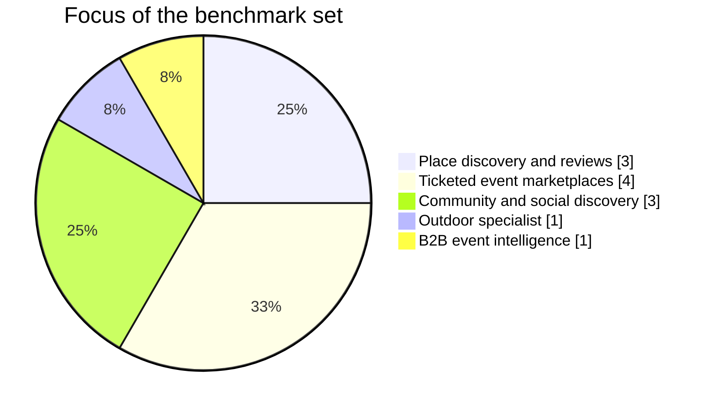
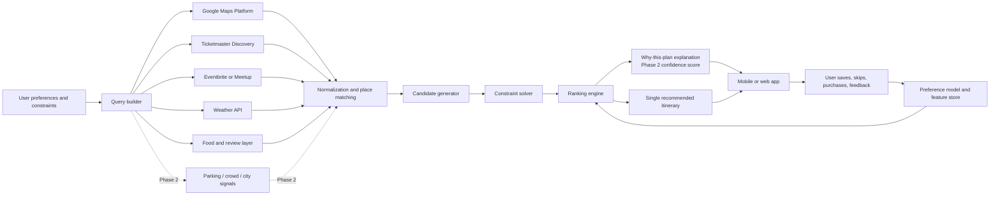

# Local Outing Decision Apps Market Analysis

## Executive summary

The current market is fragmented into five distinct product types rather than one end-to-end “where should we go right now?” decision engine. In the sample below, the strongest consumer products split into: place discovery and navigation (Google Maps, Yelp, Tripadvisor), ticketed event marketplaces (Eventbrite, Ticketmaster, Fever, Bandsintown), community and hyperlocal coordination (Meetup, Facebook Local/Events, Nextdoor), specialist outdoor planning (AllTrails), and B2B event intelligence (PredictHQ). That means users still have to stitch together discovery, constraints, routing, weather, parking, and ticketing on their own. citeturn4search5turn30search5turn34search2turn17search1turn19search0turn18search9turn12search5

For a consumer-facing US MVP, the best starting point is **not** to copy any single incumbent. Based on the feature matrix, the practical Phase 1 stack is: **Google Maps Platform** for canonical places, travel times, directions, and traffic-aware feasibility; **Ticketmaster Discovery plus one community-event source** for event inventory; **a weather API** for outdoor/rain backup logic; and **Google/Yelp-style food-place enrichment** for meal stops and cost context. Parking, crowding, civic feeds, confidence scoring, and proactive alerts should move to Phase 2 after the core recommendation flow proves useful. citeturn27view0turn5search3turn6search4turn30search0turn25search3turn26search2

The most important market gap is this: none of the surveyed products natively offer a **single recommended itinerary** that solves for budget, distance, kids/family suitability, schedule fit, weather, and availability, then exposes a **confidence score** and supports a **one-tap commit flow**. There are narrow analogues—AllTrails plans outdoor routes, Ticketmaster and Eventbrite manage inventory, Google Maps optimizes travel—but not a cross-domain outing planner that behaves like a decision engine. citeturn20search11turn18search9turn6search7turn31search11turn5search3

The feature matrix keeps that ambition but sequences it: the MVP should ship one best plan, two practical fallbacks, timeline, cost, food, explanation, actions, sharing, and feedback; the explicit Confidence Score belongs in Phase 2 after the system has enough reliability data.

A second critical finding is that some of the most appealing consumer signals are hard to productize legally or technically. For example, Google Maps shows “popular times” and live busyness in the consumer app, but the official Places API documentation emphasizes place details, search, and AI summaries rather than exposing a general public “live busyness” feed for third-party product use. Likewise, Facebook Events access is restricted, Fever’s open API is partner-oriented, Bandsintown’s API is artist/partner oriented, and Ticketmaster’s purchase APIs are partnership-gated beyond public discovery. citeturn5search2turn5search1turn23search1turn3search7turn15search0turn1search0

## Market landscape and prioritized benchmark set

The table below is ordered by **benchmarking value for your proposed product**, not by popularity. The ranking favors products that shape user expectations around local decision-making, data coverage, or transaction completion.

| Rank | App or service | Why it matters for your product | Primary use case | Platform | Business model | Primary sources |
|---|---|---|---|---|---|---|
| 1 | Google Maps | Best baseline for places, routing, travel time, reviews, and consumer habit; weak on unified event decisioning | Place discovery, navigation, travel times | web + mobile + API/SDKs | ads/local business surfaces + Maps API usage fees | citeturn4search5turn0search10turn5search3turn27view0 |
| 2 | Eventbrite | Strong long-tail local events and self-serve organizer supply; ticketing native | Event discovery and ticketing | web + mobile + API | ticketing/service fees | citeturn30search5turn10search1turn31search3turn30search0 |
| 3 | Ticketmaster | Deep inventory for major venues and high-value events; public discovery API plus restricted transaction APIs | Major live-event discovery and ticketing | web + mobile + public + partner APIs | ticketing fees, resale, partner distribution | citeturn34search2turn34search8turn6search8turn1search0 |
| 4 | Meetup | Strong intent-based community events and repeat local activity | Interest/community gathering discovery | web + mobile | organizer subscriptions + event fees | citeturn22search1turn22search5turn22search19 |
| 5 | Yelp | Strong business metadata, attributes, reviews, price level, and local commercial intent | Restaurant/service/place discovery | web + mobile + API | ads, subscriptions, API/data licensing | citeturn38search13turn11search0turn11search1turn38search2 |
| 6 | Facebook Local and Events | Still influential for social proof and community discovery, but API access is highly constrained | Social/local event discovery and RSVPs | web + mobile | ads + creator/business ecosystem | citeturn23search0turn23search1turn23search21 |
| 7 | PredictHQ | Best benchmark for structured event intelligence and impact scoring, but B2B rather than consumer UX | Event data infrastructure and demand intelligence | web + API | B2B subscriptions | citeturn12search5turn12search2turn13search1 |
| 8 | Tripadvisor | Strong attraction/“things to do” layer and reviews; useful for tourism/outings more than local spontaneity | Attractions, tours, restaurants, travel planning | web + mobile + content APIs | affiliate/booking referrals + content licensing | citeturn3search4turn14search0turn14search4turn33search4 |
| 9 | AllTrails | Best benchmark for structured outdoor family outings and route planning | Trail and park discovery | web + mobile | freemium subscription | citeturn2search5turn18search9turn1search12 |
| 10 | Nextdoor | Strong hyperlocal event/community signal and neighborhood trust layer | Hyperlocal recommendations, groups, neighborhood events | web + mobile | local ads, deals, sponsorships | citeturn19search0turn19search1turn19search7 |
| 11 | Fever | Strong curation, supply generation, and conversion-optimized purchase flow | Curated city experiences and ticketing | web + mobile + partner APIs | ticketing + affiliate + B2B ticketing | citeturn17search1turn16search3turn16search2turn3search7 |
| 12 | Bandsintown | Strong music-specific intent capture and artist-follow personalization | Concert discovery and artist alerts | web + mobile + artist/partner API | artist tools, partner deals, livestream/pay-per-view | citeturn15search0turn15search1turn15search2turn33search5 |

The distribution of incumbent focus areas shows why users still feel the “where should we go?” problem: most products optimize one slice of the stack rather than the whole outing. That synthesis follows directly from the benchmark set above. citeturn4search5turn30search5turn34search2turn19search0turn18search9turn12search5

A useful secondary lesson comes from omitted but still relevant players such as **Time Out**, **DoStuff**, and **official tourism boards**. They matter as editorial or partnership channels, but in the sources reviewed they look more like media, sponsorship, or city-guide layers than foundational systems of record for a constraint-solving consumer engine. citeturn21search3turn21search16turn20search0turn20search16turn3search4

## Feature comparison matrix

**Legend:**  
**✓** native or strong  
**◐** limited, narrow, partner-only, or indirect  
**—** not evident / not core  
**R** near-real-time or live transactional freshness  
**E** editorial / periodic / community-updated freshness  
**L / M / H** lighter / moderate / heavier privacy-sharing considerations for a consumer product

### User-facing capability matrix

| App or service | Event discovery | Place discovery | Live crowd or busyness | Ticketing or inventory | Itinerary generation | Personalization | Family or kids filters | Budget filters or cost estimates | Travel time or traffic | Parking info | Weather integration | Sources |
|---|---:|---:|---:|---:|---:|---:|---:|---:|---:|---:|---:|---|
| Google Maps | ◐ | ✓ | ✓ | ◐ | — | ✓ | ◐ | ◐ | ✓ | ◐ | — | citeturn5search2turn5search14turn4search5turn5search3turn5search1 |
| Eventbrite | ✓ | ◐ | — | ✓ | — | ✓ | ◐ | ◐ | — | — | — | citeturn30search5turn10search1turn30search0 |
| Ticketmaster | ✓ | — | — | ✓ | — | ◐ | ✓ | ◐ | — | — | — | citeturn34search2turn34search8turn6search7 |
| Meetup | ✓ | ◐ | — | ◐ | — | ✓ | ◐ | — | — | — | — | citeturn22search3turn22search19turn22search10 |
| Yelp | ◐ | ✓ | — | ◐ | — | ✓ | ✓ | ✓ | — | ◐ | — | citeturn38search13turn11search3turn11search5turn38search7 |
| Facebook Local and Events | ✓ | ◐ | — | ◐ | — | ✓ | ◐ | — | — | — | — | citeturn23search0turn23search21turn23search23 |
| PredictHQ | ✓ | ◐ | — | — | — | — | — | — | — | — | — | citeturn12search2turn12search19turn12search5 |
| Tripadvisor | ◐ | ✓ | — | ◐ | ◐ | ◐ | ◐ | ◐ | — | — | — | citeturn3search4turn14search0turn14search8turn14search9 |
| AllTrails | ◐ | ✓ | ◐ | — | ✓ | ✓ | ◐ | — | — | — | ✓ | citeturn18search9turn18search20turn2search5 |
| Nextdoor | ✓ | ◐ | — | — | — | ✓ | ◐ | ◐ | — | — | — | citeturn19search0turn19search1turn19search7 |
| Fever | ✓ | ◐ | — | ✓ | — | ✓ | ◐ | ◐ | — | — | — | citeturn17search1turn16search3turn17search17 |
| Bandsintown | ✓ | — | — | ◐ | — | ✓ | — | — | — | — | — | citeturn15search0turn15search2turn15search1 |

### Platform, freshness, API, and monetization matrix

| App or service | API availability and pricing | Data freshness | Offline use | Privacy and data sharing | Monetization options exposed by platform | External data or integrations exposed | Sources |
|---|---|---|---:|---|---|---|---|
| Google Maps | Open paid APIs/SDKs; pay-as-you-go SKUs | R | ✓ | H for location-derived services | ads + local business surfaces + API fees | maps, places, routing, geocoding, time zone, weather APIs | citeturn27view0turn24search1turn33search0 |
| Eventbrite | Open API; 2,000 calls/hour default | R | — | M; attendee data shared with organizer at purchase/registration | service fees + payment processing + organizer tooling | event/ticket/order APIs; organizer ecosystem | citeturn30search0turn31search1turn30search4turn31search0 |
| Ticketmaster | Public discovery API; transactional partner APIs restricted | R | — | M | ticketing, resale, affiliate/partner distribution | discovery across Ticketmaster, TicketWeb, Universe, FrontGate, resale | citeturn6search4turn1search0turn7search1turn34search0 |
| Meetup | No modern broad public discovery API surfaced in current official docs reviewed | E | — | M to H depending on public/private group settings | organizer subscriptions + ticket/service fees + member dues | groups, RSVPs, recurring communities | citeturn22search1turn22search10turn22search2 |
| Yelp | Public paid Places API; extra partner APIs gated | R | — | H; app privacy labels show cross-app tracking categories | ads, subscriptions, API/data licensing | reviews, price levels, business attributes, reservations/waitlist | citeturn11search0turn9search5turn38search2turn38search13 |
| Facebook Local and Events | Events API access restricted to Marketing Partners | E to R depending on creator updates | — | H social graph and account ecosystem | ads, creator/business tooling | groups, pages, events, local/community surfaces | citeturn23search0turn23search1turn23search21 |
| PredictHQ | Commercial API; plan-based access | R | — | L to M for end-user UX because it is mainly B2B data infra | B2B subscriptions | structured events, places, broadcasts, forecasts/features | citeturn12search5turn12search2turn12search19turn13search1 |
| Tripadvisor | Commercial content APIs with attribution and usage limits | E to R | — | M | booking referrals + content/API licensing | reviews, photos, location details, hotel pricing/booking APIs | citeturn14search0turn14search4turn14search3turn33search4 |
| AllTrails | No broad public places/events API surfaced in official sources reviewed | E to community-updated | ✓ | M | freemium subscription | maps, route files, health/wearables, AI assistant integration | citeturn18search6turn18search11turn18search3turn2search5 |
| Nextdoor | No broad public consumer/event API surfaced in official sources reviewed | E to community-updated | — | H due neighborhood identity/community model | local deals, sponsorships, business pages, ads | neighborhood groups, events, recommendations | citeturn19search1turn19search7turn33search13 |
| Fever | Partner APIs and affiliate tools; pricing not public in reviewed sources | R | — | M | ticketing, affiliate commissions, B2B ticketing | ticketing, white-label, reporting/transactional APIs for partners | citeturn16search2turn16search3turn3search7turn17search0 |
| Bandsintown | Artist/partner API, not a broad self-serve marketplace API | R for live music listings | — | M | artist tools, partner arrangements, livestream/pay-per-view | artist websites/apps, CTA links, music sync, livestreams | citeturn15search0turn15search2turn15search1 |

## Where incumbents still fall short

The clearest market white space is **cross-domain constraint solving**. Today’s leaders usually optimize one domain—routing, reviews, ticketing, or community—but your proposed product needs to reason across all of them at once: “two adults plus one child, under $120 all-in, within 25 minutes, indoors if the weather worsens, leave after 4 pm, easy parking, and worth the drive.” None of the surveyed products are built around that job-to-be-done as the primary interaction model. citeturn4search5turn30search5turn34search2turn19search0turn18search9turn12search5

The second gap is **single-plan commitment**. Users can discover candidates almost everywhere, and sometimes they can purchase one component of a plan, but they rarely get a single recommended itinerary that already includes place, timing, tickets, travel, parking, and weather risk. Ticketing products terminate at checkout; map products terminate at navigation; review products terminate at shortlist-building. citeturn31search11turn6search7turn5search3turn38search13turn14search9

The third gap is **predictive crowd and parking intelligence**. Google’s consumer app shows live busyness for many places, but the official documentation reviewed does not present a general public API equivalent that you can simply plug into a third-party decision engine. PredictHQ can measure event impact and demand context, and parking APIs can expose bookable inventory, but neither alone solves “how annoying will this outing feel when we arrive?” across a full consumer itinerary. citeturn5search2turn5search1turn12search5turn25search3

The fourth gap is **confidence scoring**. None of the benchmark apps present a robust, consumer-facing confidence score that explains why the system trusts a recommendation. Yet the pieces exist: inventory freshness, route predictability, weather certainty, source corroboration, and user-preference match. This is a product opportunity as much as a machine-learning opportunity, because transparency reduces user reluctance to accept one recommendation instead of ten search results. The inputs for that score can be grounded in documented transactional/event/routing feeds rather than black-box rhetoric. citeturn6search4turn30search0turn5search3turn26search2

## Recommended MVP stack and system design

For an initial US consumer MVP, the most defensible stack is matrix-led: ship the sources needed for Today's Best Plan first, then add friction and monitoring signals once users trust the planner.

| Priority | API or data source | Why first | Why not wait | Key caveat |
|---|---|---|---|---|
| First | Google Maps Platform: Places + Routes + Geocoding + Time Zone | Best canonical place graph, place search, routing, travel time, distance, traffic-aware feasibility, and map UX; documented APIs and SDKs | Everything else needs normalized places and drive-time math | Strict display/caching rules; don’t build on non-Google map with Places/Routes content in prohibited ways | 
| First | Ticketmaster Discovery API | High-value ticketed event corpus, near-real-time availability/discovery for major venues | Covers concerts, sports, theater, family events quickly | Purchase/inventory reservation flows beyond discovery are partnership-gated |
| First | Eventbrite API or Meetup GraphQL | Captures the long-tail local event market that Ticketmaster misses | Essential for neighborhood classes, pop-ups, talks, hobby groups, and community gatherings | Treat as one event-source class; coverage and API access vary, so do not make any single community feed the only event source |
| First | Weather API such as Tomorrow.io | Weather can flip outing quality, especially with family use cases | Without weather, recommendations feel careless | Need rate-limit-aware caching and fallback logic |
| First | Google Places dining and/or Yelp Places | Enables Food Nearby, price-level hints, and outing-plus-meal plans | Many family outings fail at the meal decision, not the destination decision | Yelp has tighter caching/commercial-analysis constraints; Google place display rules still apply |
| Phase 2 | ParkWhiz or parking partner | Enables Parking Check and downtown friction reduction | Parking matters, but it can follow after core plan quality is proven | Coverage varies by market and venue; access may be partner-oriented |
| Phase 2 | PredictHQ and/or BestTime | Enables Crowd & Friction Estimate, local-rank, event impact, and demand-aware scoring | Valuable for better confidence and weekend optimization | More B2B-like and likely overkill for day-one consumer MVP |
| Phase 2 | City/tourism, parks, NPS, and Socrata feeds | Enables City & Parks Signals and more free/low-cost civic options | Improves affordability and public-event coverage after the first metro workflow works | Highly fragmented by city and schema |
| Usually avoid for MVP | Facebook Events, Fever, Bandsintown partner feeds | Attractive data, but access is restricted or partner-centric | Integration friction is high relative to early-stage value | API access and product rights are not generally self-serve in reviewed docs |

The key architectural principle is to **treat no third-party as the recommender**. Third parties should provide facts: places, schedules, inventory, routing, weather, food options, and later parking/crowd context. Your product’s value comes from normalization, ranking, constraint solving, fallback generation, itinerary building, and explanation. That keeps the moat on your side and insulates the user experience from supplier fragmentation. citeturn27view0turn6search4turn30search0turn26search2turn25search3

A practical MVP ranking formula should use: **family fit**, **budget fit**, **time-window fit**, **drive-time fit**, **kid-age fit**, **weather fit**, **food adjacency**, **quality signal**, and **uncertainty penalty**. Phase 2 can add parking friction, crowding friction, confidence scoring, and leave-time optimization. That sequencing matches the feature matrix and avoids blocking the MVP on signals that are partner-gated or harder to operationalize. citeturn5search3turn25search3turn26search2turn6search4turn30search0

### Suggested MVP data flow

1. **Normalize user intent** into hard constraints and soft preferences.  
2. **Resolve places** first through Google’s place graph so events, venues, food stops, and later parking can be matched to the same canonical destination.  
3. **Fetch event candidates** from Ticketmaster and a community-event source such as Eventbrite or Meetup in parallel.  
4. **Enrich candidates** with travel time, traffic-aware feasibility, weather, food nearby, cost hints, and action links.  
5. **Run a constraint solver** that removes infeasible options before ranking.  
6. **Produce one primary recommendation plus a cheaper fallback and a rain / low-effort fallback**, each with a grounded explanation.  
7. **Track user acceptance/rejection** to learn preference weights over time. citeturn27view0turn5search3turn6search4turn30search0turn26search2turn25search3

## API access, pricing, and legal constraints

| Provider | Access model | Published rate limits or pricing | Key legal or product constraints | MVP take |
|---|---|---|---|---|
| Google Maps Platform | Open commercial APIs and SDKs | Pay-as-you-go by SKU; examples in official pricing include Places Autocomplete at $2.83 per 1,000 after the free cap, Places Nearby/Text Search Pro at $32 per 1,000 after the free cap, and Routes Compute Routes Essentials at $5 per 1,000 after the free cap. | Strict caching/display rules; Places and Routes content generally cannot be used with a non-Google map, and only limited caching is permitted under service-specific terms. | Use as the canonical map/place/routing backbone. citeturn27view0turn24search1turn24search2 |
| Ticketmaster Discovery API | Public discovery API; deeper purchase/availability APIs are partner-only | Default quota documented at 5,000 calls/day, with rate limits documented at 5 requests/second in the discovery docs and a FAQ noting public APIs are granted 2 requests/second and 5,000/day by default. | General terms prohibit building a replacement for the core Ticketmaster experience and require removal/update of event content on request; partner APIs require official distribution relationships. | Excellent for discovery, weaker for self-serve transaction control. citeturn6search4turn6search8turn6search10turn7search6turn1search0 |
| Eventbrite API | Public API with OAuth | Default rate limits documented at 2,000 calls/hour. Paid organizer economics are public: 3.7% + $1.79 service fee per paid ticket plus 2.9% payment processing per order. | Current docs remain public, but Eventbrite’s changelog indicates removal of the Event Search API, so discovery coverage strategy should not rely on one deprecated search surface. API terms are published separately. | Useful supply source, but diversify. citeturn30search0turn10search1turn31search10turn31search0 |
| PredictHQ | Commercial API | Plan-based access; trial, starter, and premium service plans are described in the official terms, with plan-specific pagination/rate-limit behavior. | Commercial B2B service; strong for structured event intelligence, less aligned with a consumer MVP’s initial UX needs. | Good phase-two enrichment layer. citeturn12search0turn12search6turn13search1turn12search5 |
| Yelp Places API | Public paid API plus partner APIs | Trial and paid usage are public in the docs: default paid plan includes 30,000 calls/month with up to 5,000/day; trial plans vary; pricing is per API call by monthly plan. | Yelp content may only be cached for 24 hours, business IDs can be stored indefinitely, and Yelp states commercial analysis is not permitted for Places integrations. | Valuable but legally tighter than many founders expect. citeturn9search5turn11search1turn6search2 |
| Tripadvisor Content API | Commercial content API | First 5,000 calls/month are free; search APIs can make up to 10,000 calls/day, with daily budget controls. | Attribution is required; official developer materials also state the product is intended for consumer-facing B2C sites/apps, and partnership terms include caching/display restrictions and content freshness obligations. | Good supplemental review/content layer, not ideal as core system of record. citeturn14search0turn14search1turn14search3turn14search4 |
| ParkWhiz | Partner API | Public developer portal exists, but pricing is partner-based rather than self-serve consumer pricing. | Full booking/search API is available for trusted partners; this is a commerce integration rather than a free public commodity feed. | Strong parking partner for v1 or v1.5. citeturn25search3turn25search7turn25search15 |
| Tomorrow.io | Open weather API with free and paid plans | Official support docs describe a free plan with 500 requests/day, 25/hour, and 3/second; paid pricing is flexible rather than a single universal sticker price. | Need normal API caching/throttling discipline; commercial use is supported through paid plans. | Best weather layer if you want a developer-focused, commercial path. citeturn26search1turn26search0turn26search3turn26search2 |
| Open-Meteo | Open weather API | Free API is limited to non-commercial use up to 10,000/day, 5,000/hour, and 600/minute; commercial subscriptions are available. | Free tier is not for commercial use; attribution is required. | Good prototype option, not the safest default for a commercial MVP. citeturn25search0turn25search4turn25search8 |
| Meta Events API | Restricted | No general self-serve public event-access pricing because event access itself is restricted. | Official docs state Events on Users and Pages are only available to Facebook Marketing Partners. | Usually not practical for an early-stage MVP. citeturn23search1 |

## Conclusion and recommended product stance

The winning positioning is not “another event app” or “another local guide.” It is **an outing decision engine** that turns fragmented local data into one feasible, confidence-weighted, family-aware plan. That is a different product category from maps, ticketing, reviews, or community sites, even though it depends on all four. citeturn4search5turn30search5turn34search2turn38search13turn19search0

The most defensible launch wedge is likely **family and small-group local plans within a time-and-budget window**, not generalized “everything to do in a city.” Families have more hard constraints, feel more friction around parking/weather/logistics, and are more likely to value a single best recommendation over endless scrolling. The incumbent set is particularly weak at that logistical intelligence layer. citeturn17search17turn19search0turn4search5turn25search3turn26search2

Practically, I would sequence the build as follows: first ship the matrix MVP - **Quick Plan Request, Family Profile, budget/time/drive constraints, place and event discovery, hard filtering, scoring, kid-age fit, weather and traffic awareness, Today's Best Plan, cheaper and rain/low-effort fallbacks, timeline, food nearby, cost breakdown, explanation, directions, ticket/reservation links, sharing, and feedback**. Then add the Phase 2 reliability layer: **City & Parks Signals, Crowd & Friction Estimate, Weekend Optimizer, Parking Check, Confidence Score, Calendar Save, Favorites/Avoid List, and Leave-Now Alerts**. Phase 3 can then add **Plan Change Alerts, Group Planning, and Deals & Coupons**. That sequence matches what the market already exposes well, while avoiding dependency on signals that are either undocumented, restricted, or expensive to operationalize too early. citeturn27view0turn6search4turn30search0turn25search3turn26search2turn23search1

## Open questions and limitations

Some data rights questions remain inherently provider-specific. In particular, several attractive data sources are **partner-oriented rather than cleanly self-serve**: Fever, Bandsintown, deeper Ticketmaster transaction APIs, and Meta Events access beyond consumer viewing. That does not block an MVP, but it does shape roadmap realism. citeturn3search7turn15search0turn1search0turn23search1

A second limitation is that “live crowd” is more available in consumer products than in openly documented developer products. The benchmark most users will mentally compare against is Google Maps’ live busyness, but that signal is not presented in the official Places API materials reviewed here as a general third-party feed. A credible MVP should therefore treat predictive crowd and parking as a **derived score** built from event size, venue type, travel congestion, and parking inventory rather than as a single licensed feed. citeturn5search2turn5search1turn25search3turn12search5

Finally, some platforms in the comparison are stronger as **content or benchmark influences** than as direct API suppliers. Time Out, DoStuff, and official tourism boards still matter for editorial curation, sponsorship, and local discovery partnerships, but they are better considered secondary distribution or content enrichment channels than the core transactional and routing stack for your first release. citeturn21search3turn21search16turn20search0turn20search16turn3search4
